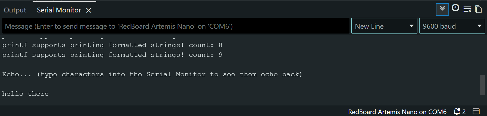
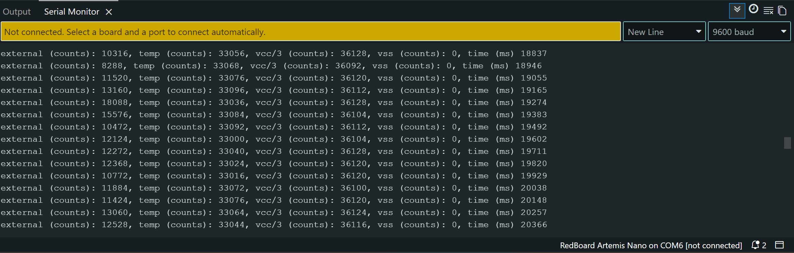
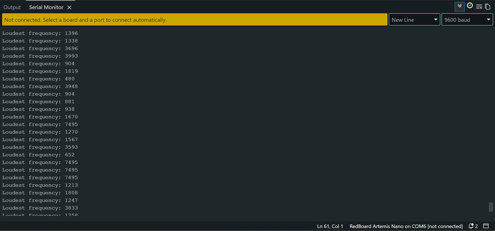
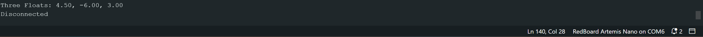
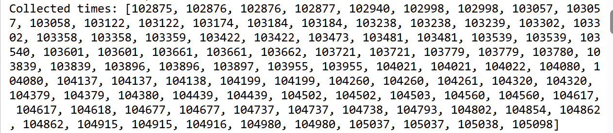
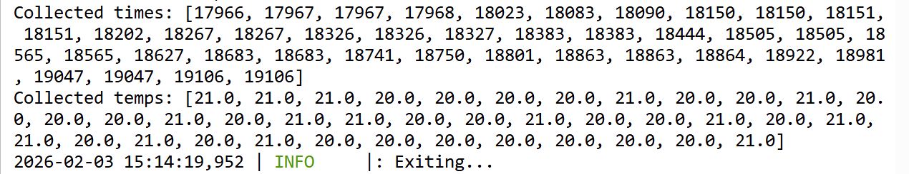

[← Back to Home]({{ '/' | relative_url }})

## Contents
* [Prelab](#prelab)
* [Lab](#lab)
* [Discussion](#discussion)

---

## prelab

#### Blink


#### Serial



#### Analog Read



#### Microphone Output



#### Arduino:
My Arduino IDE was already setup so I just had to download the packages specific for this board. For the example code I changed the baud rate to match up with the preexisting baud rate of my COM ports (9600). 

### Lab 1B:
To setup the Bluetooth connection, I installed the ArduinoBLE library, opened up ble_arduino from the unzipped files, and burned the code. The MAC address was then printed to the serial monitor and I updated connection.yaml with the MAC address and the generated UUID. 

For the most part, I followed the instructions in Lab 1 exactly. In order to activate my virtual environment for this class however, I found that I had to use
```bash
    Set-ExecutionPolicy Unrestricted -Scope Process
```
in order to give it the permissions to run.

MAC Address (Did not put the whole thing because of privacy concerns)
```bash
    Advertising BLE with MAC: c0:81:...
```

UIUD Updated in connection.yaml

```python
ble_service: 'b831d150-5b5d-4069-ac6c-820891ea74cf'

characteristics:
  TX_CMD_STRING: '9750f60b-9c9c-4158-b620-02ec9521cd99'

  RX_FLOAT: '27616294-3063-4ecc-b60b-3470ddef2938'
  RX_STRING: 'f235a225-6735-4d73-94cb-ee5dfce9ba83'
```

### Codebase
The Artemis board receives commands as strings with a TX characteristic (transmit). Through switch-case logic, it takes in a command specified through that transmission and triggers some behavior (returns time stamps, echos, etc.) These commands can be parsed using methods from RobotCommand and EString. 

UIUDs are universally unique identifiers and they're important for differentiating the different data types sent and received. There are different UIUDs for different characteristics, in this case TX strings, RX floats, RX strings. 

When data is sent from the the Artemis (via the arduino code) to the computer (via the python code) it is notified via the BLE (Bluetooth Low Energy) notifications. You can have different types of characteristics, in this instance I only used float and string characteristics. 

These characteristics determine the type of data received by the computer. These notifications allow Python to asynchronously receive the data packets and then store them into Python lists to then analyze on the computer. It's asynchronous because the computer receives data only when it is written rather than at some set time interval. 


## Lab 

### ECHO
Takes in a string from the computer and returns it with some appended text.

```python
ble.send_command(CMD.ECHO, "HiHello")
s = ble.receive_string(ble.uuid['RX_STRING'])
print(s)
```

```C++
case ECHO:
    char char_arr[MAX_MSG_SIZE];
    success = robot_cmd.get_next_value(char_arr);
    if (!success)
        return;

    tx_estring_value.clear();
    tx_estring_value.append("Robot says: ");
    tx_estring_value.append(char_arr);
    tx_estring_value.append(" :)");
    tx_characteristic_string.writeValue(tx_estring_value.c_str());
        break;
```

### SEND_THREE_FLOATS
Takes in three floats, parses them by splitting them on the '|' character and then prints them out to the serial monitor.

```python
ble.send_command(CMD.SEND_THREE_FLOATS, "4.5|-6|3")
f = ble.receive_float(ble.uuid['RX_FLOAT'])
print(f)
```

```C++
case SEND_THREE_FLOATS:
    /*
    * Your code goes here.
             
     */
    float fl_a, fl_b, fl_c;
    success = robot_cmd.get_next_value(fl_a);
    if (!success)
        return;
            
    success = robot_cmd.get_next_value(fl_b);
    if (!success)
        return;

    success = robot_cmd.get_next_value(fl_c);
    if (!success)
        return;

    Serial.print("Three Floats: ");
    Serial.print(fl_a);
    Serial.print(", ");
    Serial.print(fl_b);
    Serial.print(", ");
    Serial.println(fl_c);
    break;
```

Serial Monitor Output


### Notifications
Determines behavior when a message is received. If the string received has "Temp" in it, it will split the string value into the temperature and time part and then add them to their respective python lists. If the string received doesn't have "Temp" in it, it only has time data and adds that to the python time list. 

```python
times = []
temps = []

def notification_handler(uuid, data):
    msg = data.decode()
    print("RX:", msg)

    if msg.startswith("T:") and "Temp" not in msg:
        times.append(int(msg.split(":")[1]))

    elif "Temp" in msg:
        t_part, temp_part = msg.split(",")
        times.append(int(t_part.split(":")[1]))
        temps.append(float(temp_part.split(":")[1]))
```
### GET_TIME_MILLS
Gets the current time and send it to the computer as a string (by writing it) continuously for 3 seconds. The computer then prints out the time values in the terminal. 

We also add those times as well as temperatures at that time to an array. If we exceed the size of the array it clears the array and restarts collection. This part is relevant for the next section.

```python
ble.send_command(CMD.GET_TIME_MILLS, "")
time.sleep(2)  
print("sending time data")
```

```C++
case GET_TIME_MILLS: {
    int start = millis();
    int packet_no = 1;
    while (millis() - start < 3000) {  // stream for 3 seconds
        if (time_index < MAX_SAMPLES) {
            time_arr[time_index] = millis();
            temp_arr[time_index] = getTempDegC();  // Apollo3 function
            time_index++;
        } else {
            time_arr[MAX_SAMPLES];
            temp_arr[MAX_SAMPLES];
            time_index = 0;
        }
        tx_estring_value.clear();
        tx_estring_value.append("T");
        tx_estring_value.append(packet_no);
        packet_no++;
        tx_estring_value.append(": ");
        tx_estring_value.append((int)millis());
        tx_characteristic_string.writeValue(tx_estring_value.c_str());                  
    }
    break;
}           
```

```bash
RX: T1: 127105
RX: T2: 127106
RX: T3: 127106
RX: T4: 127106
RX: T5: 127167
RX: T6: 127230
RX: T7: 127230
RX: T8: 127287
RX: T9: 127287
RX: T10: 127288
...
RX: T45: 128126
RX: T46: 128188
RX: T47: 128188
RX: T48: 128242
RX: T49: 128249
RX: T50: 128250
```

### SEND_TIME_DATA
Loops through the time array (from the previous section) and writes those values to the computer. The notification handler then parses the received string and adds them to a python list which is then printed to the terminal. 

```python
ble.send_command(CMD.SEND_TIME_DATA, 0)
time.sleep(2)
```

```C++
case SEND_TIME_DATA: 
    for (int i = 0; i < time_index; i++) {
        tx_estring_value.clear();
        tx_estring_value.append("T:");
        tx_estring_value.append((int)time_arr[i]);
        tx_characteristic_string.writeValue(tx_estring_value.c_str());
        delay(1);  
    }
    break;
```

Time Array


### GET_TEMP_READINGS
Loops through the time and temperature arrays (from the previous section) and writes those values to the computer. The notification handler then parses the received string and adds them to their respective python lists which is then printed to the terminal. 

```python
ble.send_command(CMD.GET_TEMP_READINGS, 0)
time.sleep(2)
```

```C++
case GET_TEMP_READINGS:
    for (int i = 0; i < time_index; i++) {
        tx_estring_value.clear();
        tx_estring_value.append("T:");
        tx_estring_value.append((int)time_arr[i]);
        tx_estring_value.append(",Temp:");
        tx_estring_value.append((int)temp_arr[i]);
        tx_characteristic_string.writeValue(tx_estring_value.c_str());
        delay(1);
    }
    break;
```

Temp and Time Array



## discussion

Streaming the data is simpler and allows you to receive the timestamps and data in real time. Since it writes the data to the computer immediately, there is less memory required on the Artemis. However, because it is constantly sending data it is limited by the bluetooth BLE bandwidth. The messages are faster than the process of transmitting them over to the computer. This causes multiple notifications to be sent at the same "time" for the Artemis. In the time stamps I put above, you can see the duplicates that result from this. As a result, it can be hard to tell exactly when something was sent over because it's based on the speed of transmission and on other factors like the buffer. 

The second approach requires more code but because it is storing the data into arrays and then transmitting it over, the BLE bandwidth is not a limiting factor. The data can be sampled at even intervals. However, the main disadvantage here is that this data is being stored on the Artemis, causing increased memory usage and other potential issues with managing the amount of data that can be stored at once. 

If I wanted to sample a lot of data very slowly I would use the first option because the transmission speed wouldn't be an issue and I wouldn't have to worry about memory space. If I wanted to sample data quickly and I care about the timing being accurate, I would use the second option. An example for this is sensor data where I would want accurate timestamps and quickly sampled data. 

The Artemis has 384 kB of RAM. Each time value is a string with "T:" and the number of seconds. A string allocates 1 byte per character plus a character for \0. The times on average are a number with 6 digits so each string takes up 9 bytes. That means that we can store 42,666 data entries. Realistically though, some of that is taken up by variables so maybe 30,000 data entries might be a reasonable guess. 

------------------------------------------

I learned about how notifications work between the Artemis and the computer and the benefits of different methods of storing and transmitting data. 

