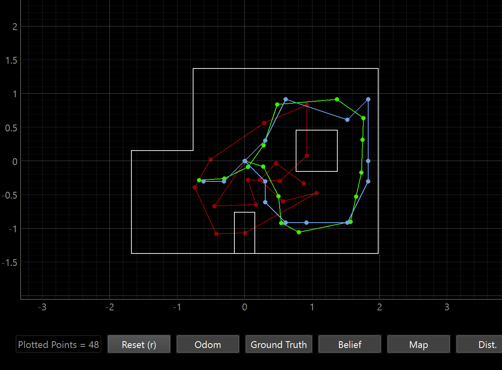

<script>
window.MathJax = {
  tex: {
    inlineMath: [['$', '$'], ['\\(', '\\)']],
    displayMath: [['$$','$$'], ['\\[','\\]']]
  }
};
</script>
<script src="https://cdn.jsdelivr.net/npm/mathjax@3/es5/tex-mml-chtml.js"></script>

[← Back to Home]({{ '/' | relative_url }})


##  Approach 

### Compute Control 
The IMU is mapped so that getting past 180 degrees switches to counting down from -180 degrees so I had to make sure that the pose math kept that in mind. This step is just using linear interpolation to get the next pose. 
```python
def compute_control(cur_pose, prev_pose):
  dx = cur_pose[0] - prev_pose[0]
  dy = cur_pose[1] - prev_pose[1]
  delta_trans = np.hypot(dx, dy)
  delta_rot_1 = mapper.normalize_angle(np.degrees(np.arctan2(dy, dx))- prev_pose[2])
  delta_rot_2 = mapper.normalize_angle(cur_pose[2] - prev_pose[2] - delta_rot_1)
  return delta_rot_1, delta_trans, delta_rot_2
```

### Odometry Motion Model
Transition probability using Gaussians for each of the parameters of the pose to compare needed control to tranisition into the next pose and the actual control state. We use compute control on the pose and the current u (commanded control) and compare the two and if the motions are pretty close then the returned probability is high. We use separate Gaussians because each type of motion (2 translation, 1 rotation) represents a physical degree of freedom the robot has. We are able to phyically (on axis turns, driving in one direction) manipulate one without changing the other so they aren't dependent on one another. However, the probabilities that we are close to the predicting position relies on all three of them being somewhat close which is why they are multiplied. 
 
```python
def odom_motion_model(cur_pose, prev_pose, u):
  rot1_u, trans_u, rot2_u = u
  rot1_hat, trans_hat, rot2_hat = compute_control(cur_pose, prev_pose)
  prob = (loc.gaussian(mapper.normalize_angle(rot1_hat -rot1_u),0,loc.odom_rot_sigma)
    * loc.gaussian(trans_hat-trans_u,0,loc.odom_trans_sigma)
    *loc.gaussian(mapper.normalize_angle(rot2_hat-rot2_u),0,loc.odom_rot_sigma))
    return prob
```

### Prediction Step
Before the prediction step, loc.bel is a 3d array of each cell containing a probability. These are the best belief about the robots location based on the most recent sensor update. However, once the robot moves, the belief changes (until the next sensor reading) and we use loc.bel_bar as a prediction for that change. Bel_bar sums over every previous step and multiplies how probable that previous state was and how likely the new motion adjustment would take the robot to the next state. This summation then gives the probability of the new state. The 0.0001 check is to avoid extra looping because this is quite a computationally heavy step. If the loc.bel at that particular step is incredibly small, it is not meaningfully adding to the overall probability sum so we can skip iterating through it because we're not going to get a lot of info out of it. The outer three loops iterate over every cell in 3d and if the belief isn't extremely small we map it to world coordinates, calculate the probability at that step and add it to the running bel_bar sum. 

```python
def prediction_step(cur_odom, prev_odom):
  u = compute_control(cur_odom, prev_odom)

  loc.bel_bar = np.zeros((mapper.MAX_CELLS_X, mapper.MAX_CELLS_Y, mapper.MAX_CELLS_A))

  for cx in range(mapper.MAX_CELLS_X):
    for cy in range(mapper.MAX_CELLS_Y):
      for ca in range(mapper.MAX_CELLS_A):
        if loc.bel[cx, cy, ca] < 0.0001:
          continue
        prev_pose = mapper.from_map(cx, cy, ca)

        for nx in range(mapper.MAX_CELLS_X):
          for ny in range(mapper.MAX_CELLS_Y):
            for na in range(mapper.MAX_CELLS_A):
              cur_pose = mapper.from_map(nx, ny, na)
              prob = odom_motion_model(cur_pose, prev_pose, u)
              loc.bel_bar[nx, ny, na] += prob * loc.bel[cx, cy, ca]

  loc.bel_bar /= np.sum(loc.bel_bar)

```

### Sensor Model

This step gets the 18 likelihoods per cell. The variable obs represent the true measurements for that cell (already known values) (one row of obs_views). The gaussian function evaluates how likely each actual measurement is given the expected measurement and sensor noise

```python
def sensor_model(obs):
  prob_array = loc.gaussian(loc.obs_range_data.flatten(), obs, loc.sensor_sigma)
  return prob_array
```

### Update Step

This step compares the expected measurements made from the ray casting to the actual measurements being received from the new sensor update. It gets the probability of each actual versus expected measurement and then multiplies them into the bel_bar for each. If the value is very plausible, the bel_bar value is high and if the value is not very plausible, the bel_bar is low. This acts as a filter as it amplifies the more plausible data. The division step just normalizes the probability to 1. The update step is important because it sharpens the distribution of bel_bar meaning we are more confident about the pose of the robot. 

```python
def update_step():
  likelihoods = np.prod(loc.gaussian(loc.obs_range_data.flatten(), mapper.obs_views, loc.sensor_sigma),axis=3)
  loc.bel = likelihoods * loc.bel_bar
  loc.bel /= np.sum(loc.bel)
```

## Implementation

This system is effective when when the robot is near walls, corners, or obstacles because each reading is more distinguishable because there's a more obvious change in distance measured at each angle. This means that the cells are very different from one another so the bel_bar will heavily favor the right cell, as will the product of the Gaussians. My robot struggles in open areas because the cells all see similar distance readings from a far off wall. That means bel is more spread out and it's harder to identify which cell is more likely when they have similar readings. 

In addition, human error is a problem If the heading estimate is off, a wrong 0 means that at fixed angular offsets from the robot's current heading, you're comparing the measurements against the wrong angular part of obs_views, causing wrong likelihoods across all the readings.

Successful Map: 
