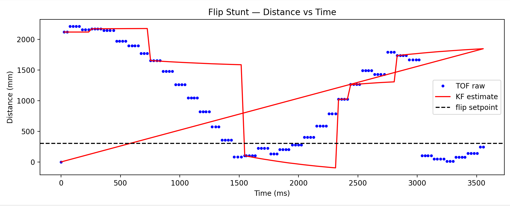
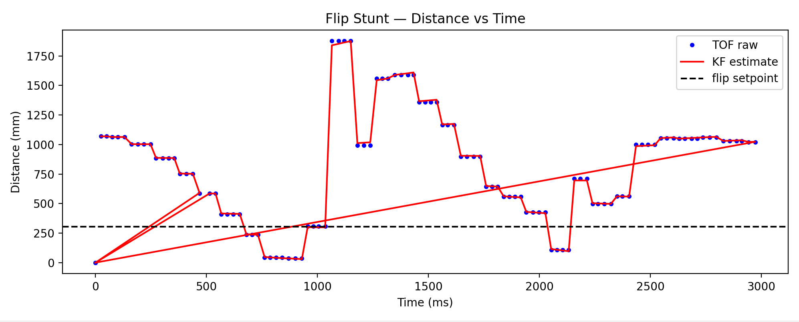

<script>
window.MathJax = {
  tex: {
    inlineMath: [['$', '$'], ['\\(', '\\)']],
    displayMath: [['$$','$$'], ['\\[','\\]']]
  }
};
</script>
<script src="https://cdn.jsdelivr.net/npm/mathjax@3/es5/tex-mml-chtml.js"></script>

[← Back to Home]({{ '/' | relative_url }})


##  Approach 

My approach was to start with the car speeding into the wall and keep the TOF sensor sampling at a high rate (same as Labs 5-7, 20ms) so that it can detect the wall. The problem with that was because the car was running at very high speeds (PWM of 200 and up) by the time the TOF sensor had detected that the distance to the wall was under the threshhold, the car would have moved forward and crashed. I thought a Kalman filter would be helpful to filter out any noisy data points confusing the sensor and give me a sense of where the car is in real time. I implemented the Kalman filter from the previous lab with essentially no changes because my sensor sample frequency is identical and it's the same car so all other parameters are the same. The TOF sensor improved it but it was still crashing into the wall or coming very very close and reversing because it was going to fast. The improvement that I made that helped was getting the kalman filter found velocity and using that to predict where the car would end up. I defined a constant braking distance which I tuned after a few trials of figuring out how long it takes for the car to slow down and multiplied that by the kalman filtered instantaneous speed to get the distance from the wall at that moment. This helped me a lot with stopping in time. 

```C++
void handleFlip() {
  log_index = 0;
  current_u = 250;

  while (!distanceSensor.checkForDataReady()) { delay(1); }
  float raw_dist = distanceSensor.getDistance();
  distanceSensor.clearInterrupt();

  x_kf(0) = raw_dist;
  x_kf(1) = 0.0;
  sig_kf = {1.0, 0.0, 0.0, 1.0};
  kf_initialized = true;

  bool updated = false;
  float startTime = millis();
  float lastKF = millis();

  drive(current_u);

  while (millis() - startTime < 8000) {
    if (!updated && distanceSensor.checkForDataReady()) {
      raw_dist = distanceSensor.getDistance();
      distanceSensor.clearInterrupt();
      updated = true;
    }

    if (millis() - lastKF >= 25) {
      kalmanFilter(current_u, raw_dist, updated);
      updated = false;

      float kf_dist = x_kf(0);
      float kf_vel  = x_kf(1);

      //brake_time = 5; //15 worked well previously
      float predicted_dist = kf_dist + kf_vel * brake_time;

      if (log_index < MAX_SAMPLES) {
        dist_log[log_index]    = raw_dist;
        dist_kf_log[log_index] = kf_dist;
        time_log[log_index]    = millis() - startTime;
        u_log[log_index]       = current_u;
        log_index++;
      }

      lastKF = millis(); 

      if (predicted_dist <= setpoint) {
        stop();
        reverse(250);  
        kf_initialized = false;
        float flipStart = millis();
        lastKF = millis();

        while (millis() - flipStart < 2000) {
          if (!updated && distanceSensor.checkForDataReady()) {
            raw_dist = distanceSensor.getDistance();
            distanceSensor.clearInterrupt();
            updated = true;
          }
          if (millis() - lastKF >= 25) {
            kalmanFilter(-250, raw_dist, updated);
            updated = false;
            if (log_index < MAX_SAMPLES) {
              dist_log[log_index]    = raw_dist;
              dist_kf_log[log_index] = x_kf(0);
              time_log[log_index]    = millis() - startTime;
              u_log[log_index]       = -250;
              log_index++;
            }
            lastKF = millis();
          }
        }
        stop();
        return;
      }
    }
  }
  stop();
}
```

One of the issues I ran into was with getting the car to stop in time. Active braking helped a lot with that problem as my stop command made the motors go to a PWM of 1 as opposed to 0. Having the motors still engaged rather than completely turned off forces the motors to slow down aggressively instead of turning off and coasting because of inertia. This helped my car make the sudden stop required to make the flip. 

```C++
void stop() {
  analogWrite(LM_F, 1);
  analogWrite(LM_B, 0);
  analogWrite(RM_F, 1);
  analogWrite(RM_B, 0);
  u_log[log_index] = 0;
  log_index++;
}
```

I had both the braking distance and the distance from the wall as parameters that I would pass in via my python commands so that I could figure out a good combination of both when acutally running my trials. 

```C++
case SEND_THREE_FLOATS:
        float fl_a, fl_b, fl_c, fl_d;
        robot_cmd.get_next_value(fl_a);  
        robot_cmd.get_next_value(fl_b);
        robot_cmd.get_next_value(fl_c);
        robot_cmd.get_next_value(fl_d);
        Kp = fl_a;
        Ki = fl_b;
        Kd = fl_c;
        brake_time = fl_d;
        min_speed = 20;
        break;
      case TO_DIST:
        float dist_py;
        robot_cmd.get_next_value(dist_py);
        setpoint = dist_py;
        break;
      case TO_FLIP:
        float dist_flip;
        robot_cmd.get_next_value(dist_flip);
        setpoint = dist_flip;
        handleFlip();
        break;
```

I then got the raw distance values and the Kalman filtered distance values as arrays in python and graphed them. When I was tuning I found that this helped me figure out if my Kalman filter was actually effective. For a lot of my earlier trials my Kalman filter readings had an offset from forgetting to update the KF filter flag, so the car was responding to the offset KF distance values that didn't correspond to the real ones. I used graphs like the one below to debug this:

Initial KF Filter with Problems:
 

Better Filter for a Later Run:
 


Here are my videos of it running:

[](https://youtu.be/Dtsjgl5BLGw)

[](https://youtu.be/L5N_h0FFInc)

[](https://youtu.be/l9EDUjT5MvU)

[](https://youtu.be/gNyw11PmsVo)

