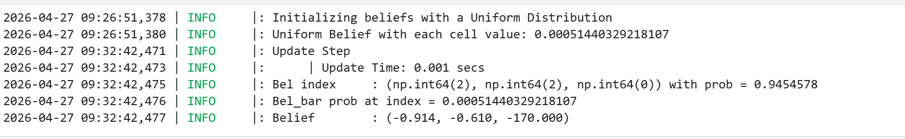
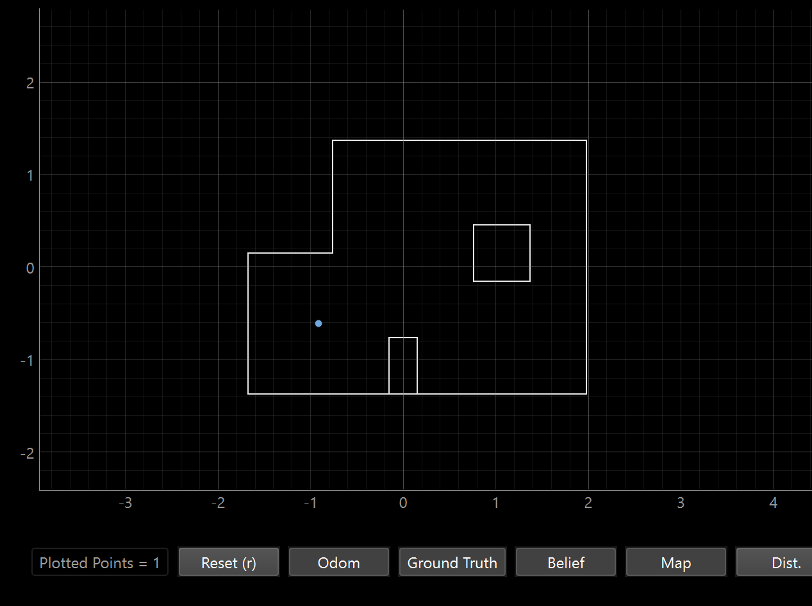
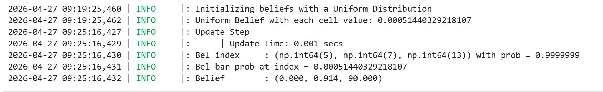
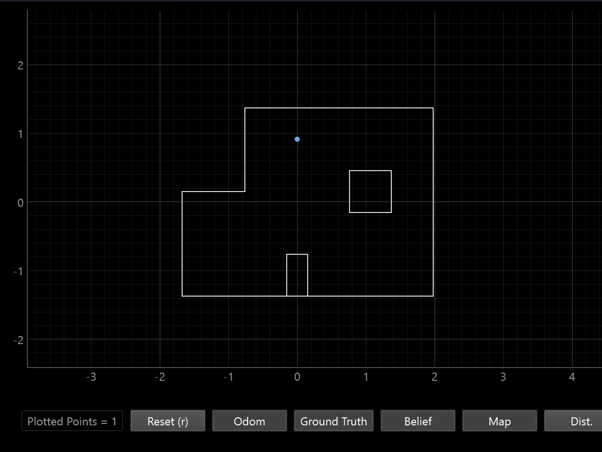
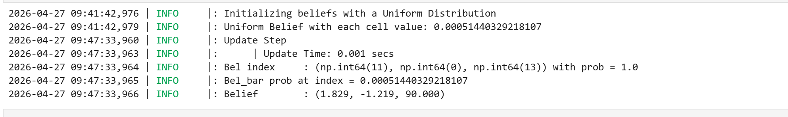
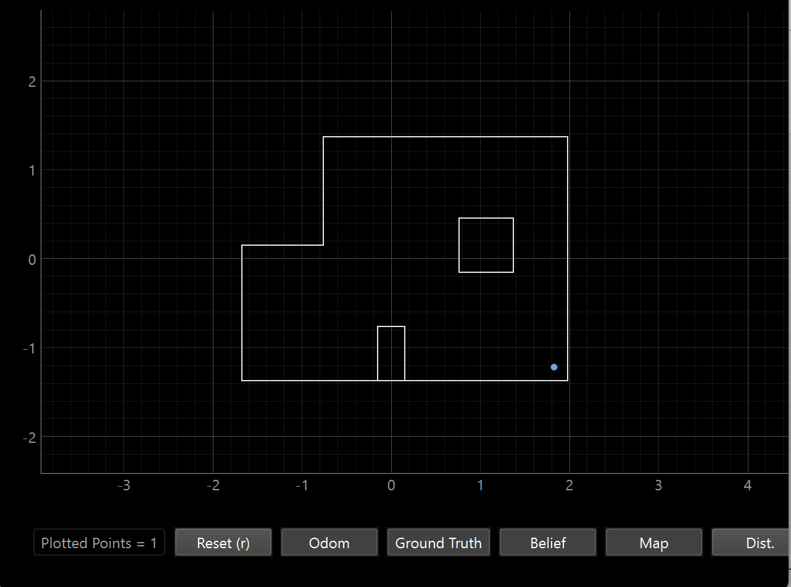
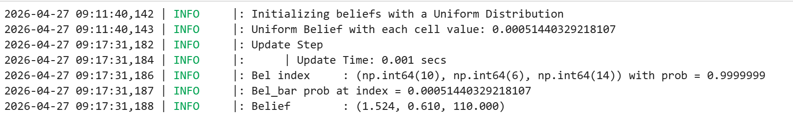
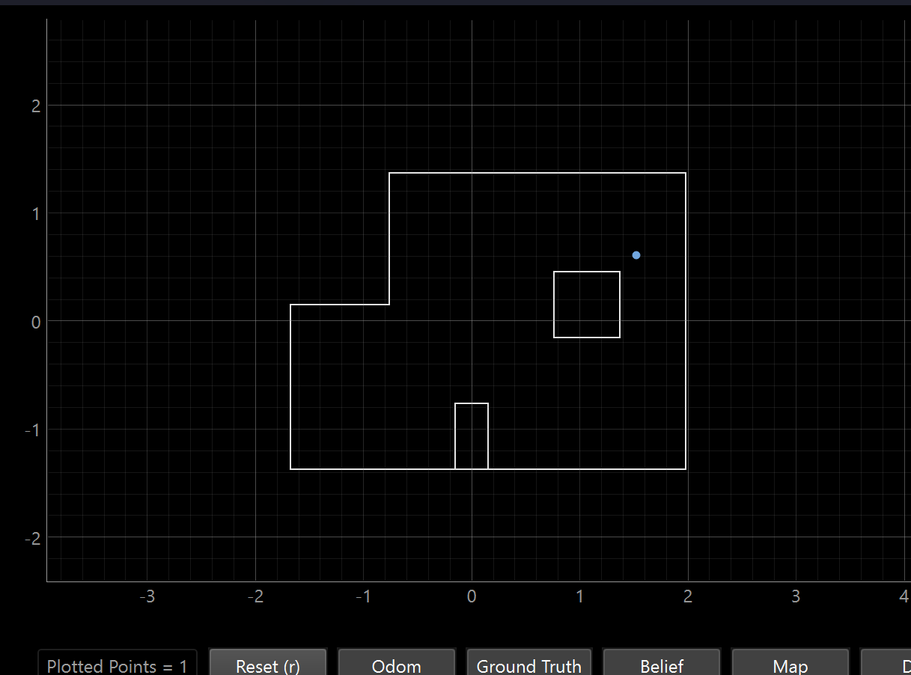

<script>
window.MathJax = {
  tex: {
    inlineMath: [['$', '$'], ['\\(', '\\)']],
    displayMath: [['$$','$$'], ['\\[','\\]']]
  }
};
</script>
<script src="https://cdn.jsdelivr.net/npm/mathjax@3/es5/tex-mml-chtml.js"></script>

[← Back to Home]({{ '/' | relative_url }})


##  Setup


I started out this lab by following the math for the equations of motion for an inverted pendulum discussed in class (photo above from Professor Helbling's lecture slides). With some algebra we arrive at the final equations:

\[
(M + m)\ddot{x} + ml\ddot{\theta}\cos(\theta) - ml\dot{\theta}^2\sin(\theta) = F - \delta\dot{x}
\]

\[
ml^2\ddot{\theta} + ml\ddot{x}\cos(\theta) + mgl\sin(\theta) = 0
\]

Which can then be put into state space form: 

\[
\Delta = ml^2\left(M + m(1 - \cos^2(\theta))\right)
\]

\[
\frac{d}{dt}
\begin{bmatrix}
x \\
\dot{x} \\
\theta \\
\dot{\theta}
\end{bmatrix}
=
\begin{bmatrix}
\dot{x} \\

\frac{(ml^2)\left(F + ml\dot{\theta}^2\sin(\theta) - \delta\dot{x} + mg\cos(\theta)\sin(\theta)\right)}
{\Delta} \\

\dot{\theta} \\

\frac{
(-ml\cos(\theta))\left(F + ml\dot{\theta}^2\sin(\theta) - \delta\dot{x}\right)
- (M+m)mgl\sin(\theta)
}
{\Delta}
\end{bmatrix}
\]

\[
\text{Linearize about:}
\qquad
x = \text{free},
\quad
\dot{x} = 0,
\quad
\theta \in \{0,\pi\},
\quad
\dot{\theta} = 0
\]

\[
\frac{d}{dt}
\begin{bmatrix}
x \\
\dot{x} \\
\theta \\
\dot{\theta}
\end{bmatrix}
=
\begin{bmatrix}
0 & 1 & 0 & 0 \\

0 & -\frac{\delta}{M} & \frac{mg}{M} & 0 \\

0 & 0 & 0 & 1 \\

0 & -\frac{\mathrm{up}\,\delta}{ML}
& \frac{\mathrm{up}(m+M)g}{ML}
& 0
\end{bmatrix}
\begin{bmatrix}
x \\
\dot{x} \\
\theta \\
\dot{\theta}
\end{bmatrix}
+
\begin{bmatrix}
0 \\
\frac{1}{M} \\
0 \\
\frac{\mathrm{up}}{ML}
\end{bmatrix}
F
\]

\[
\text{where } \mathrm{up} = 1 \text{ at } \theta=\pi
\text{ and } \mathrm{up} = -1 \text{ at } \theta=0
\]

## Localization code

```python
def perform_observation_loop(self, rot_vel=120):
  """Perform the observation loop behavior on the real robot, where the robot does  
   a 360 degree turn in place while collecting equidistant (in the angular space) sensor
  readings, with the first sensor reading taken at the robot's current heading. 
  The number of sensor readings depends on "observations_count"(=18) defined in world.yaml.
        
  Keyword arguments:
    rot_vel -- (Optional) Angular Velocity for loop (degrees/second)
                        Do not remove this parameter from the function definition, even if you don't use it.
  Returns:
    sensor_ranges   -- A column numpy array of the range values (meters)
    sensor_bearings -- A column numpy array of the bearings at which the sensor readings were taken (degrees)
      The bearing values are not used in the Localization module, so you may return a empty numpy array
  """

  sensor_ranges = []
  sensor_bearings = []

  def notification_handler(uuid, byte_array):
    "angle|distance"
    msg = byte_array.decode()
    angle, dist = msg.split(',')
    sensor_bearings.append(float(angle))
    sensor_ranges.append(float(dist) / 1000)


  self.ble.send_command(CMD.SEND_THREE_FLOATS, "1.20|0.42|0") #id
  asyncio.run(asyncio.sleep(5))

  self.ble.start_notify(self.ble.uuid['RX_STRING'], notification_handler)
  self.ble.send_command(CMD.TO_ORIENTATION, 0)  
  asyncio.run(asyncio.sleep(300))

  self.ble.send_command(CMD.GET_TOF, "")
  asyncio.run(asyncio.sleep(45))

  self.ble.stop_notify(self.ble.uuid['RX_STRING'])

  sensor_ranges   = np.array(sensor_ranges[:18])[np.newaxis].T
  sensor_bearings = np.array(sensor_bearings[:18])[np.newaxis].T
    
  return sensor_ranges, sensor_bearings
```

There wasn't too much for this step, a lot of it was transferring over the commands from lab 9. I did change the angle increments and the direction it turns for it to have 18 data points sampled counterclockwise. I tried doing the improper way of using "asyncio" described in the lab but honestly the delay consistently works across different trials so I'm not too worried about it. The only other thing I worried about here other than transferring over lab 9 code was just the formatting into numpy column arrays to fit the format expected by the rest of the filter. 

For some of the readings I did initially, I did forget to change the CCW part and the interesting thing was that my localization ran but it almost seemed like the world frame flipped axis. It would get the right x location but the negative of the y location and vice versa. 

The function returns sensor_ranges and sensor_bearings as column arrays of shape (18, 1). The bearing values are not used by the localization module, so while they are collected and returned for completeness, only the range values feed into the update step.

## Update Step

### Location 1: (-3ft, -2ft, 0) --> (-0.91 m, -0.6096 m, 0 deg)



The location it thinks it's at is (-0.914 m, -0.610, -170). The x, y coordinates are almost perfect but the angle is off. 

This makes sense to me because this location is in the bottom-left corner region of the map which helps with accuracy because being near two walls means the readings are quite distinctive. The TOF sensor will get more readings from walls in close range at specific angles which helps pinpoints the cell. Corners are very useful for localization.



### Location 2: (0ft, 3ft, 0) --> (0, 0.91 m)



The location it thinks it's at is (0, 0.914, 90). The x,y coordinates are almost perfect but the angle is off. This is near the top wall and small box obstacle so for a similar reason as location 1, the combination of multiple distinctive walls helps identify the location with more confidence.



### Location 3: (5ft, -3ft, 0) --> (1.524 m, -0.91 m)



The location it thinks it's at is (1.829, -1.219, 90). This is fairly off from the actual coordinates but I noticed that for this one my car drifted a lot. I did run it twice and got similarly off results so it might be the ray casting uncertainty I mentioned earlier. And, the angle is still off on this one. 

This location is in the bottom-right area which has relatively few nearby walls. Several of the 18 readings will be reading far distance values, which tend to be less accurate because of sensor resolution, so it may be returning similar large values regardless of the exact position. Less accuracy means neighboring cells share very similar scans and the filter can't differentiate well between them. Plus, the drift meant that the TOF sensor distance varied based on the part of the scan it was in. 



### Location 4: (5ft, 3ft, 0) --> (1.524 m, 0.91 m)



The location it thinks it's at is (1.524, 0.610, 110). The x coordinate is perfect but the y coordinate it off by 1 foot. This might be a result of my car drifting a bit. I did attempt to mitigate it with tape on the wheels and ran it multiple times but each time I would end up getting slightly off results in different directions.

This is in the top-right corner near walls so it makes sense that x is accurate. But there's a fairly large open corridor along the y-direction and in general the walls are less distinctive. If the walls run parallel to the x-axis look similar from y=0.91m and y=0.61m, the filter can't distinguish them so it struggles getting an accurate y reading. Again, the small amount of drifting just compounds this issue. 




### Overall Takeaways

The more walls and obstacles surrounding the robot from different angles, the more distinctive the readings and the more confident the sensor model is in identifying the correct cell. Open space can be a problem for localization because the lower quality sensor data for further measurements and the lack of distinctive environmental features to identify means that  many neighboring cells look identical to the filter. This makes it harder to accurately pinpoint location.

As for angle, because that was an issue for basically all the readings: Across all four locations, the heading estimate was consistently inaccurate. I think this is because of the 20 degree steps because the filter can only ever report the nearest grid cell heading, which may be 20° or more from the true value. In addition, I can't be certain I put the robot at exactly 0 degrees by hand so if I'm starting off the scan with an offset, it would throw off all the angle readings. However, these issues don't affect position in space (x,y) because the angle of the robot is an independent variable relative to the physical position and position just requires the TOF scan, not necessarily caring about the exact starting orientation. 