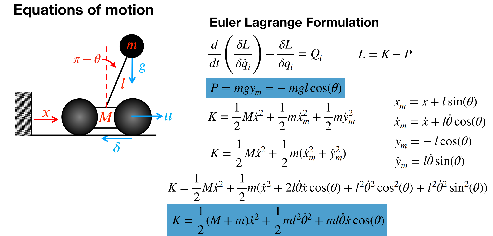
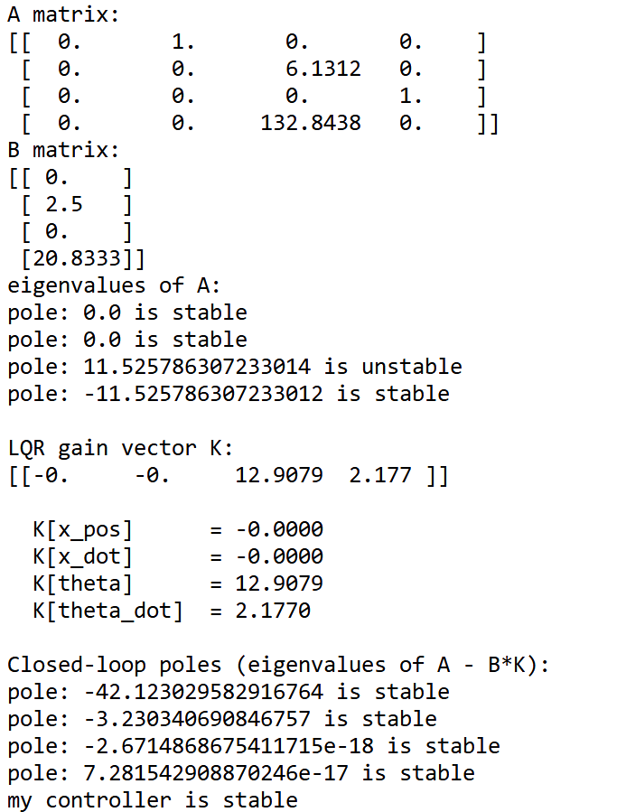
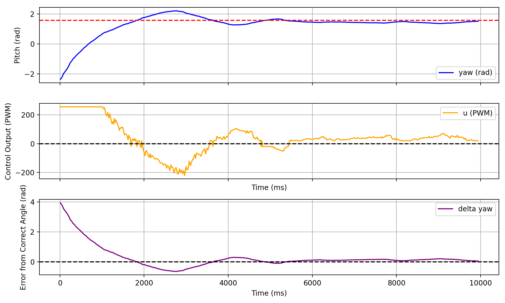
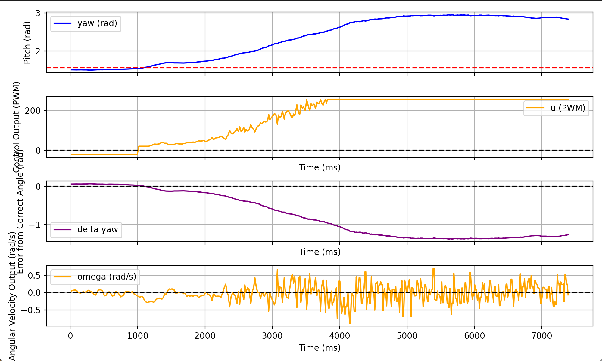

<script>
window.MathJax = {
  tex: {
    inlineMath: [['$', '$'], ['\\(', '\\)']],
    displayMath: [['$$','$$'], ['\\[','\\]']]
  }
};
</script>
<script src="https://cdn.jsdelivr.net/npm/mathjax@3/es5/tex-mml-chtml.js"></script>

[← Back to Home]({{ '/' | relative_url }})

# Controller Setup

##  Math

### Equations of Motion



I started out this lab by following the math for the equations of motion for an inverted pendulum discussed in class (photo above from Professor Helbling's lecture slides). With some algebra we arrive at the final equations:

$$
\Delta = ml^2\left(M + m\left(1 - \cos^2(\theta)\right)\right)
$$

$$
\frac{d}{dt}
\begin{bmatrix}
x \\
\dot{x} \\
\theta \\
\dot{\theta}
\end{bmatrix}
=
\begin{bmatrix}
\dot{x} \\

\frac{
ml^2\left(
F + ml\dot{\theta}^2\sin(\theta)
- \delta\dot{x}
+ mg\cos(\theta)\sin(\theta)
\right)
}{\Delta} \\

\dot{\theta} \\

\frac{
-ml\cos(\theta)\left(
F + ml\dot{\theta}^2\sin(\theta)
- \delta\dot{x}
\right)
-
(M+m)mgl\sin(\theta)
}{\Delta}
\end{bmatrix}
$$

$$
\text{Linearize about:}
\quad
x=\text{free},
\quad
\dot{x}=0,
\quad
\theta\in\{0,\pi\},
\quad
\dot{\theta}=0
$$

$$
\frac{d}{dt}
\begin{bmatrix}
x \\
\dot{x} \\
\theta \\
\dot{\theta}
\end{bmatrix}
=
\begin{bmatrix}
0 & 1 & 0 & 0 \\

0 & -\frac{\delta}{M} & \frac{mg}{M} & 0 \\

0 & 0 & 0 & 1 \\

0 &
-\frac{\mathrm{up}\,\delta}{ML} &
\frac{\mathrm{up}(m+M)g}{ML} &
0
\end{bmatrix}
\begin{bmatrix}
x \\
\dot{x} \\
\theta \\
\dot{\theta}
\end{bmatrix}
+
\begin{bmatrix}
0 \\
\frac{1}{M} \\
0 \\
\frac{\mathrm{up}}{ML}
\end{bmatrix}
F
$$

$$
\text{where }
\mathrm{up}=1 \text{ at } \theta=\pi,
\qquad
\mathrm{up}=-1 \text{ at } \theta=0
$$

We get the A and B vectors of the system from the above equations following the general form

$$
\dot{x} = Ax + Bu
$$

## LQR

### LQR vs PID

Since this is a nonlinear problem because it's a pendulum past 15 degrees either way, PID is harder to use because it's generally better for linear systems. The EOMs are linearized about the stable point at the top of the pendulum where theta = pi/2 so it's a linear system near that point. As a result, I decided to use LQR (linear quadratic regulator) because it's commonly used for nonlinear problems linearized about a point. 

### Finding the Matrices

My first step was to find the physical parameters of the system. I need the top mass, bottom mass, and length of the car. I loaded the bottom of the car (technically the front of the car the way I do the pendulum) with extra mass using a bunch of bolts and nuts so that there would be a measurable difference between M and m. I weighed both sides of the car and used a ruler to measure the length of it to find these parameters. The 'd' parameter in the formula is a friction term which I chose to ignore and set to 0 because it's a scaling factor I can deal with later. The 'up' parameter is based off of orientation of the IMU and what sign theta has so in my case I have an 'up'=1.

I then created my Q matrix. Although my state space uses x and x dot, other than practicing the stunt next to a wall every time and using the TOF, there isn't really a good way to get values for those. And because the sensor data is so noisy, my reasoning was that it would be more likely to throw off the overall balance. Because the Q matrix from class already weighs them so low (because they're not super important for balance, it's more to prevent it from wobbling which is such a secondary problem for me) I decided to just set them to 0 so my system is only based on theta and theta_dot. Theta_dot is the most important parameter because a change in it is the most consequential so it's weighed the heaviest in the Q matrix. The R vector represents how costly motor motion is. Initially I had it set very low but I tuned it to a value of 10 to get stable poles (more below).

```python
M = 0.4 
m = 0.25
l = 0.12
g = 9.81
d = 0 #delta viscous friction, can ignore for now im pretty sure
up = 1 #if theta is pi, 1; if theta is 0, -1

A = np.array([
    [0,1,0,0],
    [0,-d/M,m*g/M,0],
    [0,0,0,1],
    [0,-up*d/(M*l),up*(m+M)*g/(M*l),0]
])

B = np.array([
    [0],
    [1/M],
    [0],
    [up/(M*l)]
])

print("A matrix:")
print(np.round(A, 4))
print("B matrix:")
print(np.round(B, 4))


open_loop_poles = np.linalg.eigvals(A)
print("eigenvalues of A:")
for p in open_loop_poles:
    if (p.real > 0):
        print("pole: " + str(p) + " is unstable")
    else:
        print("pole: " + str(p) + " is stable")

#serves as an initial check for stability of the system 

Q = np.diag([
    0,       #x position, not super important here
    0,       #x dot, we don't want it to speed around but also less concerned than angular velocity 
    20,      #theta, pretty important
    35      #theta_dot, most important bc we want to get static stability
])

R = np.array([[10]]) #motors allowed to be more aggressive
```

### Poles

I then used the built in Ricatti equation solver in python to get the P vector in the below equation to solve for K, the control matrix. 

$$
K = R^{-1}\left(B^{\top}P(t) + N^{\top}\right)
$$

This can then be put into the control law. The values of K only need to be calculated once so the math doesn't need to be computationally efficient. The u values only change because the state vector values do. 

$$
u = -K*x
$$

In order to make sure that I'm building a stable system, I also get the eigenvalues for the system 

$$
\dot{x} = (A - BK)x
$$

where A and B are from above, and x is the state vector. The eigenvalues of this closed loop system (A-BK) are found using the built in python function. Poles are stable if they are below 0 because that means that the system will decay to a steady state. I get all the eigenvalues of the system and check if they are appropriate poles. If all of them are stable, I know my controller is stable.

```python
P = solve_continuous_are(A, B, Q, R) #the ricatti solver from the lecture slides 
K = np.linalg.inv(R) @ B.T @ P

A_cl = A - B @ K
closed_loop_poles = np.linalg.eigvals(A_cl)
print("\nClosed-loop poles (eigenvalues of A - B*K):")
all_stable = True
for p in closed_loop_poles:
    if (p.real < 1e-10):
        print("pole: " + str(p) + " is stable")
    else:
        print("pole: " + str(p) + " is unstable")
        all_stable = False
 
print("my controller is stable" if all_stable else "controller is unstable, redo Q and R")
```

### Tuning

Getting my controller to be stable required tweaking the Q values and the R values. I found that I could let the motors be more aggressive because in this system they are the only way of creating a change in state. Letting my Q value for angular velocity be roughly 2 times that of the angle and making my R value more aggressive got me to a stable point. Below are my exactly tuning values:



### K-matrix

The K matrix is then send to the Arduino which then multiplies it with the current state vector corresponding to the robots physical location. A gain is added because this lab is done in radians so the raw K values into angle produce extremely low u values (because we're not working in the same units anyways, the raw is u is some force unit while the u that Arduino uses is PWM). I tweaked the gain experimentally to see what gave me large enough values that it would physically move the robot. I needed a higher gain (around 20-30) for static stability because the robot doesn't start with much initial momentum so it's hard to get the wheels moving. I needed a lower gain of around 10-15 for stability coming from a flip because the robot already had momentum going in. 

```python
gain_vals = 12;
K = gain_vals*K.flatten()
def notification_handler(uuid, data):
    msg = data.decode()
    t, u, d, a, omega = msg.split(',')
    time_vals.append(float(t))
    u_vals.append(float(u))
    dist_vals.append(float(d))
    angle_vals.append(float(a))
    angle_dot_vals.append(float(omega))
    print("RX:", msg)

ble = get_ble_controller()
ble.connect()
time.sleep(0.2)
ble.start_notify(ble.uuid['RX_STRING'], notification_handler)
ble.send_command(CMD.HARD_STOP, "")
time.sleep(5)
cmd_string = "|" + str(K[0]) + "|" + str(K[1]) + "|" + str(K[2]) + "|" + str(K[3]) + "|"
ble.send_command(CMD.SEND_THREE_FLOATS, cmd_string) #handle sending over K matrix here
ble.send_command(CMD.LQR, "|0.8|");
time.sleep(30)
ble.send_command(CMD.GET_DATA, "")
time.sleep(30)
ble.stop_notify(ble.uuid['RX_STRING'])
```

# Robot Motion

## Static Stability

### Getting it To Stand:

My first step was to make it so that the robot could stand on its own (to ensure that the robot was capable of turning off the motors at the target angle). I'm not attaching a video of it because it's a pretty boring video but this mostly checked to make sure my velocity and angle signs are correct and that the motors spin the right way when moved to one side of the other. 

Some things I had to consider
- The DMP is slow so waiting for new data cannot keep the robot steady enough. Relying on stale data doesn't work when the car is tipping because it won't respond in time. My way around this was to use raw gyro data and combine that with the DMP produced roll values. The alpha threshhold acts as a filter to prevent gyro drift from affecting the data too much and control the ratio at which I use the two sources of data. So, even if DMP data is stale, the controller will still act using fresh data from the gyroscope. 
- The DMP sampling rate is set to 225 Hz: "success &= (myICM.setDMPODRrate(DMP_ODR_Reg_Quat6, 0) == ICM_20948_Stat_Ok);". This is the max rate.
- I still need to have a dead zone but I brought it significantly down from what I usually have it at (like 60 or so) to account for the gain I pass in via the python code. I still constrain the u value between -255 and 255 because that's max PWM. 
- This lab switches to radians. The EOM assumes rad/s so it was just easier to standardize it. 

```C++
void handleLQR() {
  log_index = 0;
  prev_lqr_time = millis();
  unsigned long startTime = millis();
  while (millis() - startTime < 15000) {
    unsigned long now = millis();
    float dt = (float)(now - prev_lqr_time) / 1000.0f;
    if (dt <= 0) dt = 0.001f;
    prev_lqr_time = now;
    //imu reading
    unsigned long dmp_start = millis();
    while (!check_DMP()) {
      if (millis() - dmp_start > 2) break;
    }   //remove blocking so controller can respond fast
    myICM.getAGMT();
    theta_dot = myICM.gyrX() * PI / 180.0f; 
    //lqr control law
    theta = alpha * (theta + theta_dot * dt) + (1.0f - alpha) * roll;
    float u = -(K[2]*(theta-(PI/2)) + K[3]*theta_dot);
    const float MIN_PWM = 20.0;
    //dead zone
    if (abs(u) > 0 && abs(u) < MIN_PWM) {
      u = MIN_PWM * (u > 0 ? 1.0f : -1.0f);
    }
    u = constrain(u, -255, 255);
    drive(u);
    if (log_index < MAX_SAMPLES) {
      time_log[log_index] = millis() - startTime;
      u_log[log_index] = u;
      dist_log[log_index] = 0;
      angle_log[log_index] = theta;
      angle_dot_log[log_index] = theta_dot;
      log_index++;
    }
  }
  stop();
}
```

### Graphs



## Flip 

The problem with getting it to stand from its stable point is that either it just kinda stands there without doing anything. If i start it in an unstable initial condition (I hold it in place at an angle), the minute I let go the controller doesn't have time to respond and the robot ends up falling down. Instead, I decided to flip into the pendulum position so that I could always start my robot from a fixed position and I could still show the pendulum control (shout out to Aravind Ramaswami, Nita Kattimani, and Anunth Ramaswami for the original idea).

To get it into the flip position I have it perform the same steps that it did for the stunt lab:

- Initial dmp_start section is just so the DMP gets warmed up and doesn't throw weird data
- The flip was just having it go full speed forward for a bit, active stopping (PWM 1) for a very short while, and then fully reversing for a short while. I tuned the delay after the reverse so that I still catch the robot while it's in the air. 
- The flip timeout checks if the flip is succesful by checking the IMU. If it is we proceed to the LQR method from above. If it isn't we stop because the car has hit the ground and getting into the pendulum is impossible. 
- It stops the car in midair so that the LQR commanded u value doesn't immediately jerk the car and destabilize it. 

```python
void handleFlipToBalance() {
  log_index = 0;
  unsigned long dmp_start = millis();
  while (millis() - dmp_start < 500) {
    check_DMP();
    delay(5);
  }
  while (!check_DMP());
  theta = roll;
  drive(255);
  delay(400); 

  analogWrite(LM_F, 1); analogWrite(LM_B, 0);
  analogWrite(RM_F, 1); analogWrite(RM_B, 0);
  delay(3); 
  analogWrite(LM_F, 0);
  analogWrite(RM_F, 0);
  analogWrite(LM_B, 250);
  analogWrite(RM_B, 250);
  delay(40);
  unsigned long flipTimeout = millis();
  while (millis() - flipTimeout < 1500) {
    unsigned long dmp_start = millis();
    while (!check_DMP()) {
      if (millis() - dmp_start > 5) break;
    }
    myICM.getAGMT();
    theta_dot = myICM.gyrX() * PI / 180.0f;
    theta = 0.95f * (theta + theta_dot * 0.005f) + 0.05f * roll;

    //switch to LQR when its close
    if (abs(theta - PI/2) < 0.25 && abs(theta_dot) < 2.0) break;
  }
  stop();
}
```

### Graph



### Video


You can see it translates a lot. I will fix that if I have time but I do need to turn this in on time. Any video updates made after midnight are mostly for fun. 


# Other Code

## Graphing Code

```python
fig, (ax1, ax2, ax3, ax4) = plt.subplots(4, 1, figsize=(10, 6), sharex=True)
    
ax1.plot(time_vals, angle_vals, label='yaw (rad)', color='blue')
ax1.axhline(y=np.pi/2, color='red', linestyle='--')
ax1.set_ylabel('Pitch (rad)')
ax1.legend()
ax1.grid(True)

delta_yaw = np.pi/2 - np.array(angle_vals)

ax3.plot(time_vals, delta_yaw, label='delta yaw', color='purple')
ax3.axhline(y=0, color='black', linestyle='--')
ax3.set_ylabel('Error from Correct Angle (rad)')
ax3.set_xlabel('Time (ms)')
ax3.legend()
ax3.grid(True)
    
ax2.plot(time_vals, u_vals, label='u (PWM)', color='orange')
ax2.axhline(y=0, color='black', linestyle='--')
ax2.set_ylabel('Control Output (PWM)')
ax2.set_xlabel('Time (ms)')
ax2.legend()
ax2.grid(True)
   
ax4.plot(time_vals, angle_dot_vals, label='omega (rad/s)', color='orange')
ax4.axhline(y=0, color='black', linestyle='--')
ax4.set_ylabel('Angular Velocity Output (rad/s)')
ax4.set_xlabel('Time (ms)')
ax4.legend()
ax4.grid(True)
  
plt.tight_layout()
plt.show()
```

## DMP Angles

```C++
bool check_DMP() {
  icm_20948_DMP_data_t data;
  myICM.readDMPdataFromFIFO(&data);

  if ((myICM.status == ICM_20948_Stat_Ok) || 
      (myICM.status == ICM_20948_Stat_FIFOMoreDataAvail)) {

      if ((data.header & DMP_header_bitmap_Quat6) > 0) {
        double q1 = ((double)data.Quat6.Data.Q1) / 1073741824.0;
        double q2 = ((double)data.Quat6.Data.Q2) / 1073741824.0;
        double q3 = ((double)data.Quat6.Data.Q3) / 1073741824.0;
        double q0 = sqrt(max(0.0, 1.0 - q1*q1 - q2*q2 - q3*q3)); 

        double qw = q0; 
        double qx = q2;
        double qy = q1;
        double qz = -q3;

        // roll (x-axis rotation)
        double t0 = +2.0 * (qw * qx + qy * qz);
        double t1 = +1.0 - 2.0 * (qx * qx + qy * qy);
        roll = atan2(t0, t1);

        // pitch (y-axis rotation)
        double t2 = +2.0 * (qw * qy - qx * qz);
        t2 = t2 > 1.0 ? 1.0 : t2;
        t2 = t2 < -1.0 ? -1.0 : t2;
        pitch = asin(t2);

        // yaw (z-axis rotation)
        double t3 = +2.0 * (qw * qz + qx * qy);
        double t4 = +1.0 - 2.0 * (qy * qy + qz * qz);
        yaw = atan2(t3, t4);
        
        return true;

      } else {
        return false;
      }
  } else {
    return false;
  }
}
```