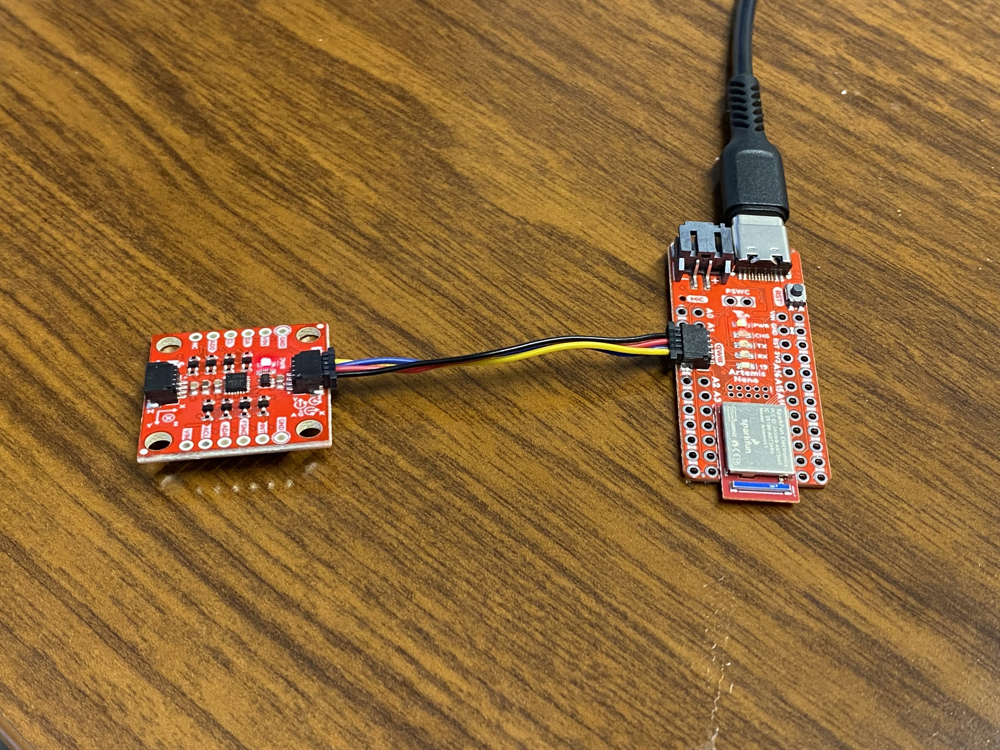
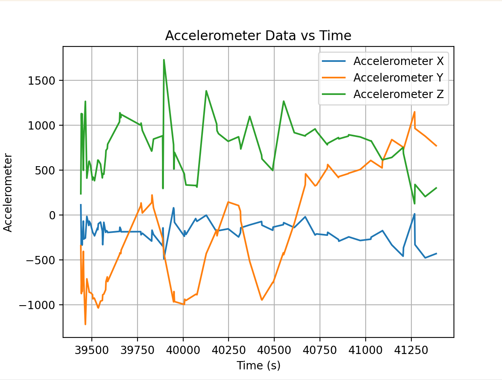
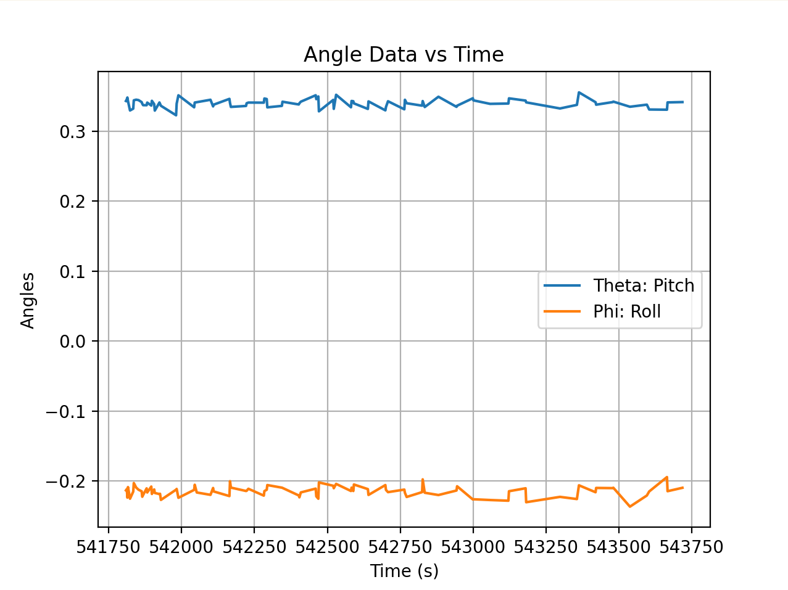
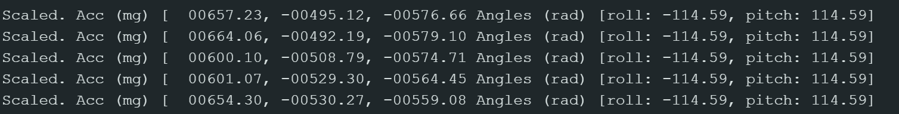

<script>
window.MathJax = {
  tex: {
    inlineMath: [['$', '$'], ['\\(', '\\)']],
    displayMath: [['$$','$$'], ['\\[','\\]']]
  }
};
</script>
<script src="https://cdn.jsdelivr.net/npm/mathjax@3/es5/tex-mml-chtml.js"></script>

# Complementary Filter Notes

$$
\theta_g = \theta_g + \text{gyro\_reading} \times dt
$$

---
layout: default
title: "Lab 2"
permalink: /LAB-2/
description: "Writeup for Lab 2."
---

[← Back to Home]({{ '/' | relative_url }})

## Contents
* [Lab Tasks](#labtasks)
* [Accelerometer](#accelerometer)
* [Gyroscope](#gyroscope)
* [Sample Data](#sampledata)
* [Stunt](#stunt)

---

## labtasks

#### Setup IMU



The IMU plugs into the qwiic connect port on the side of the Artemis Nano. The red light is on indicating that it is receiving power. 


I started off running the basic code provided in the IMU library and rotated by IMU in random directions to see how the data values change. 

#### AD0_VAL

We're using the [ICM-20948](https://cdn.sparkfun.com/assets/7/f/e/c/d/DS-000189-ICM-20948-v1.3.pdf) as our IMU sensor for this lab. We're using I2C for communication in this instance so the AD0 pin is related to the I2C address of the board. There are two potential addresses, high and low corresponding to 1 and 0 respectively. Because two addresses are available, it is possible to connect two ICM-20948 sensors to the same I²C bus as long as each one has a different AD0 configuration. The default for this board and the example code is HIGH or AD0 = 1 so we stick with that in order for the Artemis Nano and the IMU to communicate. If we wanted to use LOW or AD0 = 0, we would need to close the ADR jumper. There's no point in doing this unless we're connecting another sensor to the second port (same I2C bus though). 

## accelerometer 

### Accelerometer

The accelerometer measures linear acceleration in m/s^2. It measures all acceleration felt in the environment (because it's based on a spring force balance) including gravity. If the accelerometer is held parallel to the ground, the acceleration value read would equal 9.81 m/s^2 (acceleration due to gravity). When tilted, the acceleration due to gravity is decomposed into the directions of the body axis of the accelerometer. Based on the values recorded in each axis we can determine the angle at which they've been rotated by. However, because accelerometer values are based on gravity, we cannot determine the rotation in yaw because the accelerometer still experiences the same acceleration in the z-direction as it remains parallel to the ground. 

For example,
$$
\a_z = g*\cos\ {\theta}
$$

$$
\a_x = g*\sin\ {\theta}
$$

$$
\theta = \arctan\frac{a_x}{a_z}
$$

$$
\phi = \arctan\frac{a_y}{z_z}
$$

#### Code

I took the accelerometer data and sent it via BLE to my computer where I graphed the values in python. The data on the Arduino was combined into a large string with the time stamps, accelerometer data in every direction, and gyroscope data in every direction separated by commas. I then processed the data inside the notification handler in python by parsing using the commas and then sorting each into separate arrays. 



I was moving the IMU around while taking the data so you can see a lot of peaks and noise from the shaking. 

```python
    def notification_handler(uuid, data):
        print("notification handler")
        msg = data.decode()
        times.append(float(msg.split(",")[0]))
        accX.append(float(msg.split(",")[1]))
        accY.append(float(msg.split(",")[2]))
        accZ.append(float(msg.split(",")[3]))
        gyrX.append(float(msg.split(",")[4]))
        gyrY.append(float(msg.split(",")[5]))
        gyrZ.append(float(msg.split(",")[6]))
        

    times.clear()
    accX.clear()
    accY.clear()
    accZ.clear()
    gyrX.clear()
    gyrY.clear()
    gyrZ.clear()  
    ble.start_notify(ble.uuid['RX_STRING'], notification_handler)


    ble.send_command(CMD.GET_IMU, "")

    time.sleep(2)  

    ble.stop_notify(ble.uuid['RX_STRING'])
```

Code for graphing the IMU raw data:

```python
    def init_plots():
        plt.plot(times, accX, label="Accelerometer X")
        plt.plot(times, accY, label="Accelerometer Y")
        plt.plot(times, accZ, label="Accelerometer Z")
        
        plt.xlabel("Time (s)")
        plt.ylabel("Accelerometer")
        plt.title("Accelerometer Data vs Time")
        plt.legend()
        plt.grid(True)
        
        plt.show()

        plt.plot(times, gyrX, label="Gyroscope X")
        plt.plot(times, gyrY, label="Gyroscope Y")
        plt.plot(times, gyrZ, label="Gyroscope Z")
        
        plt.xlabel("Time (s)")
        plt.ylabel("Gyroscope")
        plt.title("Gyroscope Data vs Time")
        plt.legend()
        plt.grid(True)

        plt.show()
```

The accelerometer data is fairly accurate, if not slightly noisy. Here's the data when the accelerometer is still (but not in any particular orientation)




I tried to get the accelerometer to be at -90,0,90. I think there is a constant offset in the accelerometer because it's consistently 114 deg at physically 90 deg angles. So, with that offset in mind this is what the serial monitor looked like. 



#### Fourier Transform

I transformed the data to see where the highest amplitude frequencies are to determine where to put the cutoff frequency for a low pass filter. Below is the transform code for the raw acceleration data in x (similar code for y and z) as well as the transform code for theta and phi.

```python
    dt = np.mean(np.diff(times)) / 1000
    Fs = 1 / dt

    N = len(accX)

    fft_vals_x = np.fft.fft(accX)
    freqs_x = np.fft.fftfreq(N, d=dt)

    positive_x = freqs_x > 0

    freqs_x = freqs_x[positive_x]
    fft_magnitude_x = np.abs(fft_vals_x[positive_x])

    plt.plot(freqs_x, fft_magnitude_x, label="FFT of Accelerometer X")
```

For theta
```python
    fft_vals_th = np.fft.fft(theta)
    freqs_th = np.fft.fftfreq(N, d=dt)

    positive_th = freqs_th > 0

    freqs_th = freqs_th[positive_th]
    fft_magnitude_th = np.abs(fft_vals_th[positive_th])

    plt.plot(freqs_th, fft_magnitude_th, label="FFT of Theta")
```

For phi
```python
    fft_vals_phi = np.fft.fft(phi)
    freqs_phi = np.fft.fftfreq(N, d=dt)

    positive_phi = freqs_phi > 0

    freqs_phi = freqs_phi[positive_phi]
    fft_magnitude_phi = np.abs(fft_vals_phi[positive_phi])

    plt.plot(freqs_phi, fft_magnitude_phi, label="FFT of Phi")
    plt.xlabel("Frequency (Hz)")
    plt.ylabel("Magnitude")
    plt.title("FFT of Angles")
    plt.grid(True)
    plt.show()
```


If table vibration is introduced:


#### Low Pass Filtering

Based on this data, it looks like a good cutoff frequency would be around 10-12 because there's a major peak after then. This makes sense to me because most of the signal of interest (tilt or orientation changes) occurs at low frequencies, typically below 5–10 Hz, since human or board movements are slow. Anything at much higher frequencies is most likely electrical noise or mechanical vibration. Choosing the correct cutoff frequency is important because if the cutoff is too conservative, you risk missing actual useful data. If the cutoff is too high, you introduce excessive noise into your sensor readings. 

With a cutoff frequency of 10 Hz, the comparison between the angle data before and after filtering is shown below. The low pass filtered data has less excessive spikes than the raw data which is exactly the behavior expected. There is probably a low pass filter built into the board because I don't see excessively high frequencies meaning a lot of the electrical noise is probably already filtered out. When I tried vibrating the table by lightly tapping near the IMU, the FFT didn't have giant spikes near the higher frequencies which indicates to me that it's been filtered out already. 


The forumlas for a low pass filter are \theta_{\text{LPF}}[n] = \alpha \cdot \theta_{\text{RAW}} + (1-\alpha) \cdot \theta_{\text{LPF}}[n-1] \\
\theta_{\text{LPF}}[n-1] = \theta_{\text{LPF}}[n]

The code for the filtered graph:
```python
    fc = 10 

    alpha = (2*np.pi*fc*dt) / (1 + 2*np.pi*fc*dt)

    filtered = np.zeros_like(theta)
    filtered[0] = theta[0]

    for i in range(1, len(theta)):
        filtered[i] = alpha*theta[i] + (1-alpha)*filtered[i-1]

    plt.plot(times, theta, label="Raw")
    plt.plot(times, filtered, label="Filtered")
    plt.legend()
    plt.show()
```

Sidenote: When working with angles and converting between radians and degrees and in general doing trig, it's important to use atan2 in order to utilize the entire -\pi to \pi range. I also coded a wrap-around function to make sure that the angle values remain within that range:

```python
    def wrap_angle(angle):
        return (angle + np.pi) % (2*np.pi) - np.pi
```

## gyroscope

### Gyroscope

The gyroscope measures the rate of angular change in degrees/second using an array of springs that experience Coriolis acceleration when spun. Because it already measures the derivative of angles in every direction, the formulas for roll, pitch, and yaw are fairly straightforward:

$$
\theta_g = \theta_g + \text{gyro\_reading} \times dt
$$

Gyroscopes are nice in the sense that they can measure yaw because they don't care about acceleration due to gravity. However, one of the key advantages of an IMU is having both gyroscope and accelerometer data for sensor fusion. Sensor fusion allows us to be more confident about the readings by reducing uncertainty and noise through corroboration via multiple sensors. Because the accelerometer doesn't record yaw rotation, we only rely on gyroscope data for yaw rotation which means we can't use sensor fusion in that direction. 

In addition, because gyroscopes calculate angle by integrating over small time steps dt, it's vulnerable to experiencing drift because tiny bias or noise can accumulate over time and throw the sensor readings off. However, they are better at short term changes than accelerometers are because the quick time integration makes it less vulerable to spikes during quick motion. 

This can be seen in the data readings from the gyroscope:

Raw Readings:


The drift can be clearly seen here. The IMU was stationary during this data recording but the angles changes over time in particular directions. 


In order to combine the gyroscope and accelerometer data I used a complementary filter to combine the streams of data. The formula is:
$$
\theta = (\theta + \theta_g)(1 - \alpha) + \theta_a \alpha
$$

Code:
```python
    #accel angles
    roll_acc  = phi
    pitch_acc = theta

    #alpha - just picked a threshhold
    alpha = 0.98

    roll_cf  = np.zeros(len(times))
    pitch_cf = np.zeros(len(times))

    roll_cf[0]  = roll_acc[0]
    pitch_cf[0] = pitch_acc[0]

    for i in range(1, len(times)):
        #predicted off of the previous values - technically I've calculated this previously but it's nice to have in one place
        roll_pred  = roll_cf[i-1]  + gyrX[i] * dt
        pitch_pred = pitch_cf[i-1] + gyrY[i] * dt

        #fusing them together 
        roll_cf[i]  = alpha * roll_pred  + (1 - alpha) * roll_acc[i]
        pitch_cf[i] = alpha * pitch_pred + (1 - alpha) * pitch_acc[i]


    plt.figure()
    plt.plot(times, roll_acc, label="Roll Acc", alpha=0.5)
    plt.plot(times, roll_gyr, label="Roll Gyro Drift", alpha=0.5)
    plt.plot(times, roll_cf, label="Roll Complementary", linewidth=2)
    plt.legend()
    plt.title("Roll Comparison")
    plt.show()

    plt.figure()
    plt.plot(times, pitch_acc, label="Pitch Acc", alpha=0.5)
    plt.plot(times, pitch_gyr, label="Pitch Gyro Drift", alpha=0.5)
    plt.plot(times, pitch_cf, label="Pitch Complementary", linewidth=2)
    plt.legend()
    plt.title("Pitch Comparison")
    plt.show()
```

Comparison Plots - For both roll and pitch, combining the data smooths out the values so that they're the same magnitude as the accelerometer data but not as noisy. 
Roll:


Pitch:


## sampledata

In order to make the loop go faster, I took out all the Serial.prints because those are quite slow. I also removed any extraneous delays that aren't necessary for the code to run. My timestamps for each data value are below:

```bash
[43935.0, 43937.0, 43942.0, 43944.0, 43946.0, 43954.0, 43970.0, 43972.0, 43977.0, 43979.0, 44004.0, 44006.0, 44011.0, 44029.0, 44046.0, 44048.0, 44051.0, 44061.0, 44072.0, 44090.0, 44092.0, 44097.0, 44124.0, 44177.0, 44187.0, 44237.0, 44245.0, 44300.0, 44302.0, 44358.0, 44360.0, 44423.0, 44482.0, 44484.0, 44538.0, 44540.0, 44598.0, 44658.0, 44660.0, 44716.0, 44725.0, 44781.0, 44839.0, 44841.0, 44847.0, 44899.0, 44957.0, 44967.0, 45015.0, 45025.0, 45077.0, 45079.0, 45141.0, 45143.0, 45196.0, 45259.0, 45261.0, 45266.0, 45321.0, 45383.0, 45385.0, 45440.0, 45442.0, 45499.0, 45617.0, 45619.0, 45681.0, 45683.0, 45737.0, 45796.0, 45806.0, 45860.0, 45862.0, 45914.0]
```

This is quick enough for the purposes of testing right now but I would probably need it to go faster when I actually am using my car. 

I think it makes the most sense to store all the data together in one string and then send over the strings and parse in python. For one, that means less tasks for the Arduino code to do which means that the parsing can happen concurrently with sending over the data. In addition, sending it as one command rather than two or more separate commands for gyroscope and accelerometer data means that there are less packets in general to send over which means that we can reduce delay. I do split the gyroscope and accelerometer data into separate arrays but I do it in python where I have more space to allocate in memory to store these large arrays and again, I can parse them concurrently with the message sending. 

When I send it in strings, I'm really sending it over as a series of characters. This is easy to transmit over BLE but it is memory inefficient and it's hard to do math with them. I largely resolve that by doing the math in python where I care less about efficiency. Integer or long data would be nice because it wouldn't require parsing but that would require sending over a lot more packets, which would mean the data transmission is quite slow. A better solution there would be a float because a lot of the data is in decimal format. Doubles are overkill for the level of precision we need for the acceleration and gyroscope data and requires way too much storage.

So it's mostly between storing the data as a String and storing it as a float. Floats require less storage and would be easy to do math with but require more BLE transmissions because I'd have to send each packet as its own number. Strings are a lot more storage but are more efficient with BLE because all the data can be sent at once if concatenated into a string and then parsed later on. However, it does require more storage space. I decided that the rate of transmission is more important than storage because I want my IMU to collect data fast. The best compromise however, is probably storing the data on the Arduino as floats and then converting to strings when sending the data over with BLE. 

Storage requirements: Each string is going to be 7 floats stored as characters plus 6 commas so 41 bytes per string. Accounting for extra characters like negative signs will bring me to 45 bytes per string. The Arduino has 384 KB of storage so I can store roughly 8533 strings (not counting extra memory allocation for things like arrays and other data structures so realistically it's more like 7,000). At a sampling rate of 100 Hz, I should be able to store data for 70 seconds or slightly over a minute. If I sample at a slower rate (200 Hz), I could sample for 140 seconds. 

IMU data for 5 seconds: You can see from the timestamps that 5 seconds have elapsed between the first and the last timestamp:

```bash
Collected times: [165391.0, 165393.0, 165397.0, 165399.0, 165401.0, 165413.0, 165424.0, 165432.0, 165434.0, 165443.0, 165445.0, 165459.0, 165461.0, 165470.0, 165472.0, 165480.0, 165487.0, 165505.0, 165507.0, 165509.0, 165519.0, 165527.0, 165537.0, 165539.0, 165547.0, 165558.0, 165568.0, 165570.0, 165573.0, 165622.0, 165624.0, 165631.0, 165682.0, 165684.0, 165687.0, 165744.0, 165746.0, 165753.0, 165755.0, 165801.0, 165803.0, 165809.0, 165863.0, 165865.0, 165872.0, 165919.0, 165921.0, 165980.0, 166045.0, 166047.0, 166101.0, 166103.0, 166158.0, 166166.0, 166225.0, 166227.0, 166284.0, 166286.0, 166337.0, 166400.0, 166402.0, 166463.0, 166465.0, 166519.0, 166583.0, 166585.0, 166638.0, 166640.0, 166702.0, 166757.0, 166767.0, 166818.0, 166820.0, 166878.0, 166880.0, 166938.0, 166999.0, 167001.0, 167060.0, 167062.0, 167120.0, 167122.0, 167179.0, 167241.0, 167243.0, 167300.0, 167302.0, 167363.0, 167365.0, 167420.0, 167422.0, 167479.0, 167536.0, 167546.0, 167596.0, 167605.0, 167659.0, 167661.0, 167719.0, 167777.0, 167835.0, 167900.0, 167955.0, 168023.0, 168077.0, 168137.0, 168202.0, 168260.0, 168320.0, 168378.0, 168443.0, 168500.0, 168560.0, 168622.0, 168679.0, 168736.0, 168803.0, 168856.0, 168922.0, 168980.0, 169041.0, 169097.0, 169155.0, 169216.0, 169276.0, 169340.0, 169397.0, 169454.0, 169520.0, 169578.0, 169636.0, 169702.0, 169762.0, 169821.0, 169880.0, 169936.0, 170000.0, 170062.0, 170116.0, 170176.0, 170238.0, 170300.0]
Collected accX: [230.957, 230.468, 232.91, 230.957, 244.14, 239.257, 242.187, 230.957, 234.375, 235.351, 237.792, 241.21, 242.675, 242.187, 224.609, 235.351, 240.722, 229.98, 240.234, 231.445, 236.328, 233.886, 227.05, 239.746, 222.656, 229.003, 248.046, 232.91, 239.746, 242.187, 234.375, 244.628, 237.792, 239.257, 231.933, 238.769, 237.304, 240.234, 243.164, 238.281, 229.98, 233.398, 234.863, 233.886, 225.097, 233.398, 231.933, 228.027, 231.933, 239.257, 237.792, 233.886, 243.652, 237.792, 231.445, 239.746, 228.515, 235.351, 238.769, 230.468, 236.328, 243.652, 241.21, 232.91, 247.07, 240.722, 233.886, 232.91, 239.257, 233.398, 237.304, 243.652, 237.304, 229.003, 220.214, 239.746, 239.746, 233.886, 228.027, 239.746, 242.675, 229.98, 224.121, 248.535, 228.027, 232.421, 237.792, 232.91, 231.445, 231.445, 231.933, 238.769, 246.582, 235.351, 226.562, 228.515, 233.398, 232.421, 242.675, 236.328, 234.863, 236.816, 241.699, 240.234, 221.679, 242.187, 236.816, 226.074, 243.652, 239.257, 235.839, 239.746, 227.05, 232.91, 243.652, 231.445, 238.769, 234.863, 242.675, 224.121, 234.863, 240.722, 244.14, 236.816, 236.816, 228.027, 236.328, 233.886, 236.328, 231.445, 240.722, 235.839, 232.91, 235.839, 231.445, 242.187, 245.117, 237.304, 232.91, 239.746, 230.957, 228.515]
Collected accY: [-143.554, -143.554, -126.953, -135.253, -127.441, -127.441, -140.625, -122.07, -130.371, -134.277, -127.929, -133.3, -129.394, -123.046, -125.488, -120.605, -128.906, -125.976, -125.976, -139.16, -122.07, -121.093, -139.648, -141.113, -122.07, -143.554, -122.558, -135.253, -125.0, -133.3, -131.347, -136.718, -123.046, -137.695, -124.511, -130.371, -132.324, -135.742, -124.511, -129.882, -148.925, -133.3, -131.835, -127.441, -127.441, -137.207, -145.996, -126.953, -129.882, -127.441, -112.792, -133.789, -135.253, -127.441, -137.695, -136.718, -132.324, -132.324, -128.417, -132.324, -128.906, -140.625, -125.976, -134.277, -131.835, -136.23, -136.23, -120.605, -118.164, -134.765, -115.234, -139.648, -124.511, -123.046, -138.671, -120.605, -130.371, -137.695, -141.601, -125.488, -130.371, -132.324, -135.742, -134.765, -122.07, -136.23, -128.417, -129.394, -128.417, -119.628, -137.207, -135.742, -125.0, -133.789, -115.722, -135.742, -120.117, -125.488, -129.882, -125.0, -125.0, -139.648, -139.648, -128.906, -148.437, -128.906, -127.929, -132.324, -133.3, -125.0, -130.859, -130.371, -129.882, -145.019, -125.976, -124.511, -137.695, -139.648, -122.07, -134.277, -126.953, -116.699, -126.464, -135.742, -133.789, -135.253, -142.089, -131.347, -132.324, -131.347, -129.394, -131.347, -124.511, -133.3, -137.695, -133.3, -135.253, -137.695, -130.371, -127.441, -130.859, -133.3]
Collected accZ: [1007.324, 1001.464, 991.21, 996.582, 1008.789, 996.582, 1000.976, 1004.882, 992.187, 1006.835, 1004.882, 990.722, 1000.0, 1001.464, 996.093, 1002.441, 1000.0, 1003.417, 994.628, 1004.882, 999.511, 1006.835, 1002.929, 1005.371, 1001.464, 1006.347, 1002.441, 1004.394, 998.046, 1003.417, 1007.324, 1001.953, 996.582, 1002.441, 998.046, 992.187, 1001.953, 1006.347, 1000.488, 996.582, 993.652, 993.164, 996.093, 1007.812, 1006.347, 1001.953, 1009.765, 1001.953, 1011.718, 1009.277, 1010.742, 997.07, 1011.23, 1004.394, 995.605, 1007.324, 1002.441, 993.652, 994.14, 1009.765, 1016.113, 1005.859, 1005.859, 1003.417, 1002.929, 1000.488, 1003.417, 1002.929, 1009.277, 992.675, 1002.441, 1010.742, 1016.113, 1007.812, 1010.253, 995.117, 1001.464, 1000.488, 1014.648, 990.722, 1007.812, 1000.488, 1000.0, 1002.441, 1008.789, 993.164, 1005.371, 1010.253, 1008.789, 1001.464, 1005.371, 1003.906, 1003.417, 1006.835, 992.675, 1009.765, 1004.394, 1000.976, 990.722, 1006.835, 995.605, 1001.953, 994.14, 1003.417, 1002.929, 1006.835, 995.605, 997.07, 1008.3, 1002.929, 997.558, 997.558, 1001.953, 999.511, 1010.253, 1000.488, 1003.906, 997.07, 1011.23, 998.046, 1004.882, 1001.953, 1010.253, 996.093, 1008.3, 1013.183, 996.093, 1005.859, 989.746, 999.023, 1004.882, 1009.277, 1004.394, 1006.347, 990.722, 994.628, 1001.464, 991.21, 1008.789, 1014.16, 1003.417, 1001.464]
Collected gyrX: [-3.656, -0.633, 0.725, 0.076, 0.618, 0.893, 1.19, 2.58, 1.87, 2.167, 0.305, -2.526, 0.816, -0.167, -0.786, 0.511, -0.694, -2.282, -1.732, 0.106, -0.694, -1.603, -1.045, 1.473, 0.251, 2.458, 1.282, 2.274, 2.488, -0.603, -2.702, -2.786, 0.366, 2.74, 3.893, -2.877, -1.854, -1.03, -0.916, 3.458, 2.221, 2.099, -2.145, -0.687, -1.48, -0.053, 1.114, 0.854, -1.167, 1.541, 1.351, 0.763, 0.427, 0.702, 0.923, 0.366, -1.48, 1.801, 0.74, -0.519, 0.458, -0.068, 0.961, 2.061, 1.427, 0.015, 1.625, 0.106, -0.908, -1.946, -0.099, 1.396, 1.32, -1.038, -1.335, 1.595, -2.259, -4.671, 0.786, 1.122, -1.236, -1.251, 1.183, 0.137, -2.862, 1.366, 1.374, -0.045, -0.572, -0.19, -0.664, 0.725, -0.87, -1.045, 2.427, 0.709, -1.954, -1.778, 1.793, -0.732, 1.702, -1.916, 0.335, -1.114, 0.732, 0.847, 0.038, -0.9, -2.984, 2.694, -3.923, 4.595, -4.16, 2.19, -1.358, 0.854, -1.625, -0.297, -0.022, 0.473, 0.45, -1.244, 0.595, -0.442, 3.007, -0.083, 1.083, -0.847, -0.351, 0.534, -0.725, 0.679, -0.221, 1.641, -3.053, 0.801, -2.122, 1.671, -1.068, 1.022, -0.145, -0.152]
Collected gyrY: [1.763, 0.847, -0.526, 0.534, -3.687, -0.717, -2.015, -2.381, 0.0, -0.381, 0.61, 0.389, -0.954, -0.29, -0.755, -0.244, 0.557, 1.038, -1.114, 1.984, 0.893, -0.259, -0.641, -0.389, 0.633, -1.992, -0.396, -0.908, -2.9, 0.877, -1.961, 1.786, -2.48, -1.74, -0.656, -1.877, 1.702, 0.412, -1.038, -1.816, -0.038, -1.793, -0.099, -1.954, -0.167, -0.656, -1.068, -0.396, -0.435, 0.183, 0.32, -0.419, -1.305, 2.473, 0.32, -0.595, 0.061, -1.045, -0.786, -0.832, 0.534, -1.755, -1.175, -0.091, -1.625, 1.167, -1.244, 2.007, -1.572, -1.16, 1.381, 0.885, -2.152, -1.862, 1.557, -1.351, -0.106, 0.709, -1.725, -0.351, -0.824, 0.816, -2.076, -0.435, 1.572, 0.32, 0.587, -1.816, -0.259, -1.389, 1.167, -2.358, 0.259, -0.343, -0.167, -1.312, -1.099, 1.908, 0.145, 1.244, 0.404, 0.351, 0.977, 1.122, 0.427, 1.328, 0.488, 0.725, 0.0, -1.083, -1.702, -1.717, 1.984, -1.122, -0.358, -0.641, -0.877, -0.435, -0.893, -0.465, -0.534, -0.244, -0.709, -0.206, -2.496, -0.358, 0.099, 1.603, -0.9, -0.48, 0.152, -1.778, 0.709, -0.541, 0.29, -0.503, -0.664, -0.671, -0.656, 0.9, -0.992, 0.427]
Collected gyrZ: [1.251, 1.519, -0.87, -0.183, -1.206, -2.885, -1.404, 0.412, -1.351, -0.564, 0.625, -0.702, 0.694, 1.381, -1.61, 1.832, -0.251, 2.038, -2.0, 0.221, -1.274, 0.709, 0.175, -1.404, 1.007, 1.648, 1.519, -1.77, -1.687, 1.244, -1.175, -2.045, -0.312, -1.282, -1.282, -2.236, -0.526, -0.167, -1.961, -0.183, -0.091, 1.923, 2.274, -0.396, 0.305, -0.236, -0.603, 1.458, 0.305, -0.29, -0.03, -2.076, 0.244, -0.603, 3.0, -0.862, 1.129, -1.946, -0.427, -2.236, 0.496, 1.427, -1.839, 1.954, -0.519, 2.053, 0.572, 1.122, -0.007, -2.396, 1.603, 0.404, 0.946, 1.045, 1.328, 1.0, -1.778, 0.282, -0.167, -1.702, 1.908, -0.083, 1.473, 2.183, 0.297, -0.862, -0.389, 1.48, 0.099, -0.687, -1.328, -1.045, 0.77, -1.061, -1.213, -0.725, -0.694, -1.099, -1.175, -0.335, -0.32, -0.229, -1.496, 0.038, 0.648, -0.419, -0.152, -0.19, -1.435, 1.236, 0.61, -1.435, -0.106, 0.664, -1.198, -1.595, 0.664, -0.725, -0.198, -0.015, -1.938, -1.564, -0.03, 1.343, -2.358, -2.839, -1.328, 1.839, -1.74, -1.419, -0.77, -2.732, -1.404, 1.015, -1.511, -1.938, 1.473, 0.259, 0.251, -0.824, -0.923, -0.648]
```
