<script>
window.MathJax = {
  tex: {
    inlineMath: [['$', '$'], ['\\(', '\\)']],
    displayMath: [['$$','$$'], ['\\[','\\]']]
  }
};
</script>
<script src="https://cdn.jsdelivr.net/npm/mathjax@3/es5/tex-mml-chtml.js"></script>

[← Back to Home]({{ '/' | relative_url }})

## Contents
* [Prelab Tasks](#prelab)
* [Lab Tasks](#labtasks)
* [IMU](#imu)

---

## prelab

The VL53L1X has a default 8-bit I²C address of 0x52. However, the least significant bit is a read-write bit which isn't super significant for our purposes. The Artemis I²C is a 7-bit address so we left shift the address from 0x52 to 0x26 (01010010 to 0-0101001). So, the default address of the VL53L1X is 0x26 address and since both sensors are on the same I²C bus, they will both automatically try to communicate on that address which causes communication issues. There is no way to distinguish each sensor from the other in hardware because the pinout is VDC, VIN, GND, SDA, SCL, XSHUT, and GPIO1. Unlike the IMU which had an AD0/AD1 option, the only way to distinguish the sensors from each other is to change the address in the code once they are plugged into the Artemis. 

So, in order to use the two sensors, one of them has to be assigned a different I²C address. The address itself can be found by scanning the bus and I found that 0x2A was open so I used that as my second I²C address. Since I can't turn both sensors on immediately because of the address conflict, I have to start by only having one active on the bus which I did by soldering the XSHUT pin on one of the TOF sensors to pin 8 on the Artemis and then writing it low. This kept the other sensor active and I began that sensor and assigned that sensor to 0x2A. Then, I wrote pin 8 on the Artemis to high which made the TOF sensor active and I began the sensor. Since no address was assigned to the second TOF sensor it defaulted to 0x29 which is fine because I had already set the first sensor to a different address. 

### Sensor Placement
There should be sensors at the front and the sides to prevent any sort of collisions to the front half of the car. We don't need TOF sensors in the back because we know where the car is if we know the orientation and the distance of the front to some obstacle. Since there are 2 TOF sensors, the best approach would be to put each one on the front left and front right, respectively, angled at around 45 degrees. This allows sensor fusion for obstacle detection of objects immediately in front of the robot because both sensors can see it while also allowing the robot to see on both sides. 

### Wiring Diagram
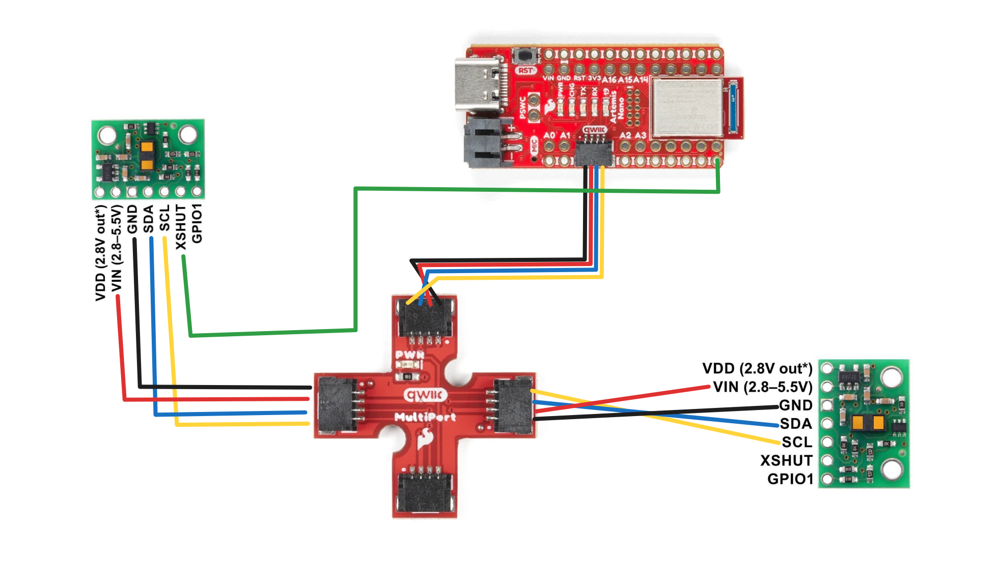


## labtasks
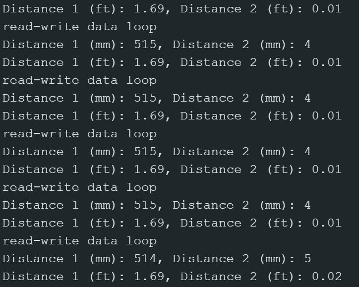

This is my serial monitor after having 2 TOF sensors and 1 IMU plugged in. 

```bash
Both sensors online!
Sensor A renamed to 0x2A
Sensor B booted at 0x29
Both sensors online!
Found device at 0x15
Found device at 0x29
Found device at 0x69
```

Code for scanning the bus:
```C++
for (byte address = 1; address < 127; address++) {
    Wire.beginTransmission(address);
    if (Wire.endTransmission() == 0) {
      Serial.print("Found device at 0x");
      Serial.println(address, HEX);
    }
  }
```
### Distance Modes
The IMUs have 3 distance modes: short, medium, and long. The long range mode allows a ranging distance of 4m but is more sensitive to ambient light and/or other light related error because of how much of the environment it is taking in. The short range mode has a smaller distance of 1.3m but is less light sensitive because it doesn't have to range in a large area. For this lab and also generally for the robot I think short range is enough because 1.3 meters is quite a lot relative to the size of the robot. 

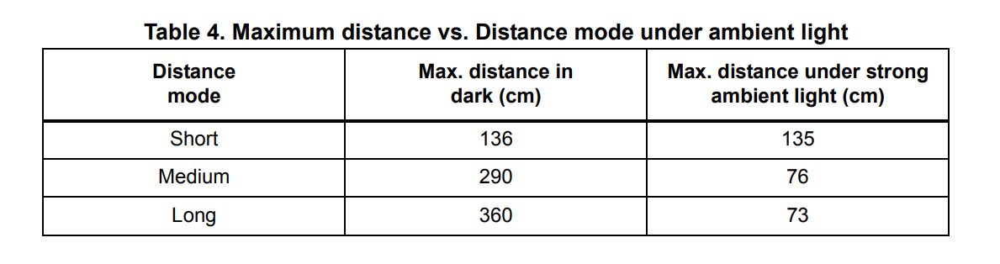

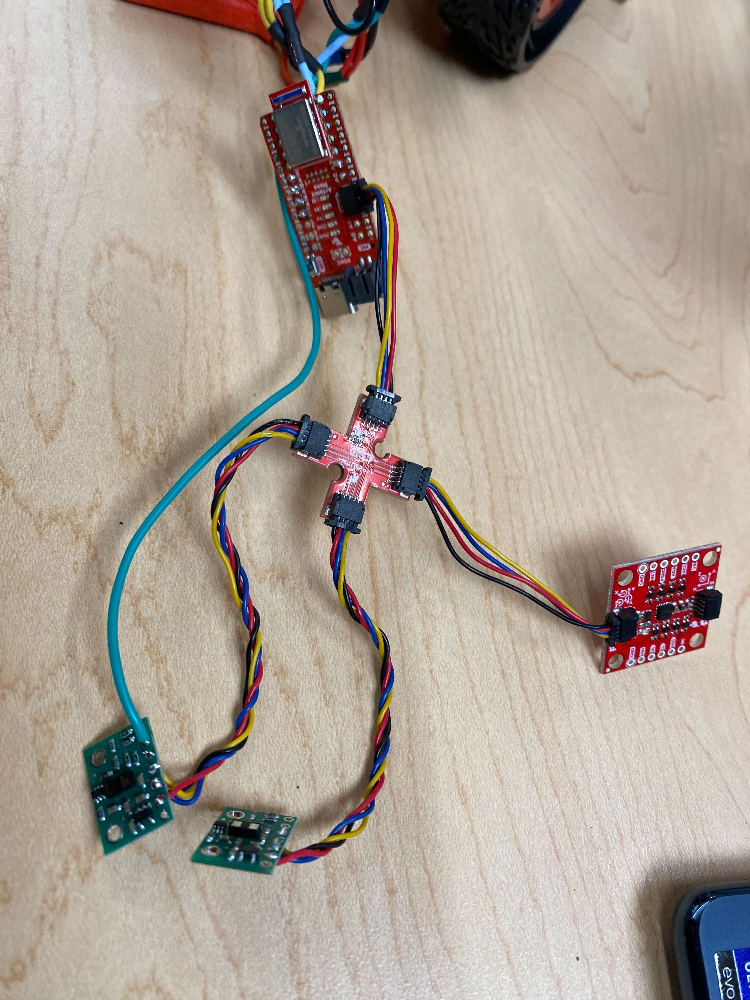

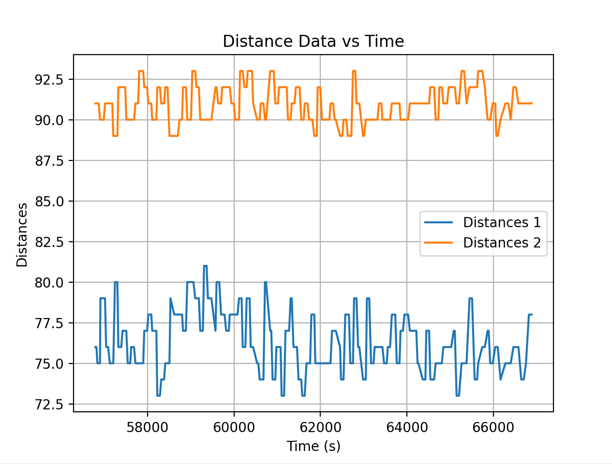
This is the sensor data for 0.1 meters.


## Testing the range of the sensor
I taped the motor to a vertical box surface and then marked 0.1m increment lines on tape. Obstacles were placed at set distances to determine how accurate the data sensing was and I also tested in different ambient conditions to determine the effect that light would have on the sensor. 

It seems like one of the sensors is consistently more off than the other and i wonder if that has to do with it being positioned physically taller than the other/if I positioned it slightly crooked. The sensor that did record data fairly well (the target was 0.8m away) seemed to do it best in very well lit conditions (room light was on and I had my phone light on over the obstacle). This is counterintuitive to what I'd expect from the reading about the IMU light sensitivity. Especially because 0.8 is close to the middle of the range that short distance mode sensors record in I would expect it to be accurate and I would expect it to work better in darker areas. 

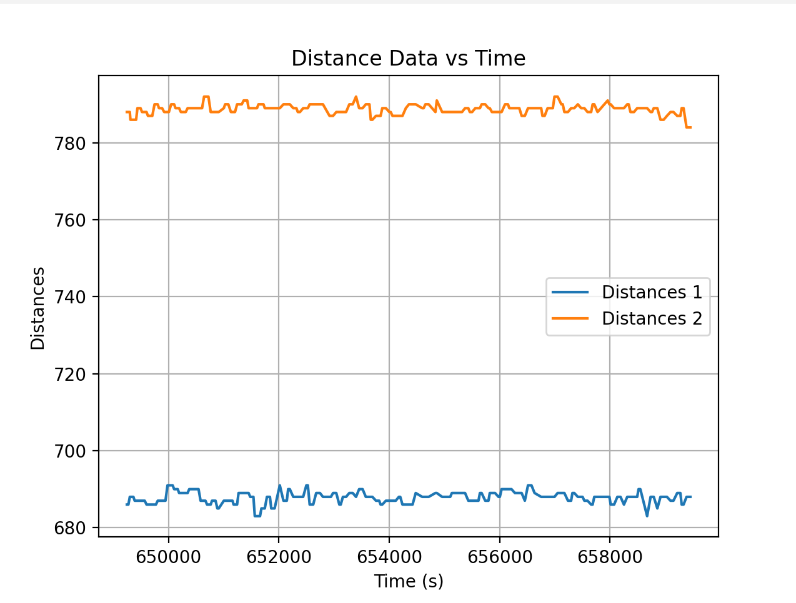


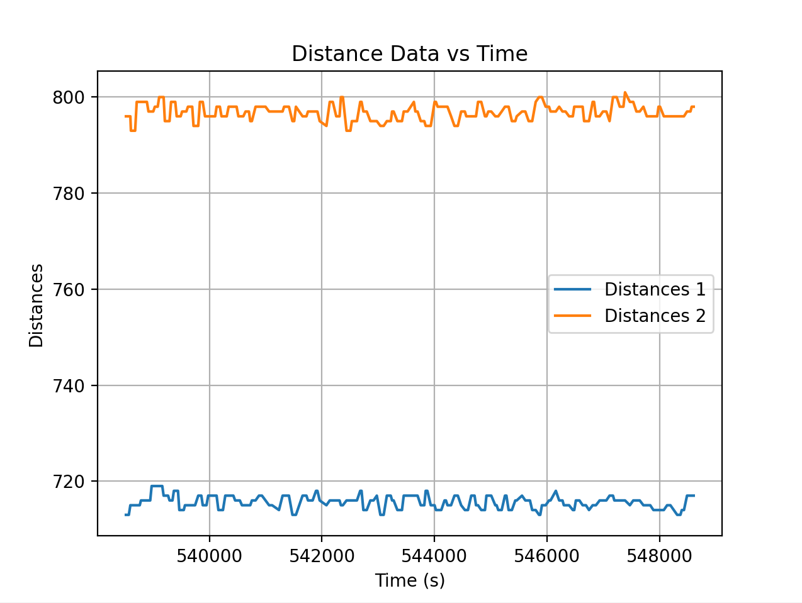


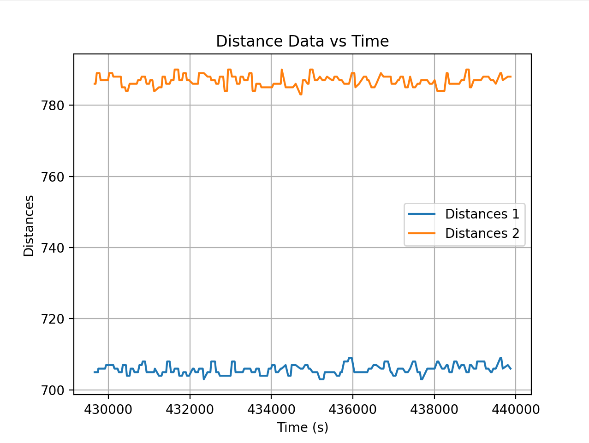


Printed output on the console:
```bash
RX: 548,442,1237413.000,20.019,-630.859,833.496
RX: 548,442,1237451.000,14.648,-616.210,840.332
RX: 547,439,1237511.000,11.718,-620.117,831.054
RX: 547,439,1237574.000,12.695,-628.417,830.566
RX: 547,442,1237598.000,18.066,-620.117,839.843
RX: 546,442,1237694.000,26.367,-627.441,834.960
```

## Timestamps
To determine the time that it takes between each timestamp I decided to record all the data values and then get the delta time values between each reading and plot on a histogram to figure out generally the time it takes for each reading. I filtered out the 2% outliers as I had 3 significant outliers and I don't think they're relevant for what I'm determining. I used checkForDataReady to determine when it would send data over and I get the timestamp before I actually send over bluetooth each time so it captures the time at which the reading it taken. It seems that the main limiting factor is the rate at which the data is sampled by each TOF sensor and specifically my condition is that both sensors have to be ready which is what explains the time periods not being the same and not having a set peak in delta frequencies. 

Serial speed: The baud rate is 115200 which means 115200 bits/s or 14400 bytes/s. Each data packet with the combination of timestamp, IMU data, and TOF data from 2 sensors is about 60 characters or 60 bytes meaning that the max frequency is 240 Hz. BLE is most likely splitting up these data packets so the Serial frequency is more just a order of magnitude approximation, BLE might be 25% of that or around 50 Hz. 

The default timing budget for short mode on the TOF sensors is 20 ms which corresponds to a frequency of 50 Hz. The minimum timing budget for any mode on the sensor is 33 ms which corresponds to a frequency of 30 Hz. So realistically most of the time the main restriction on timing is going to be the sensor update speed and combined with a similar frequency for BLE as well as the condition for both sensors to have new data means that all three could be restricting factors at different points in data collection. That would also explain why I don't have a defined peak on my histogram. 

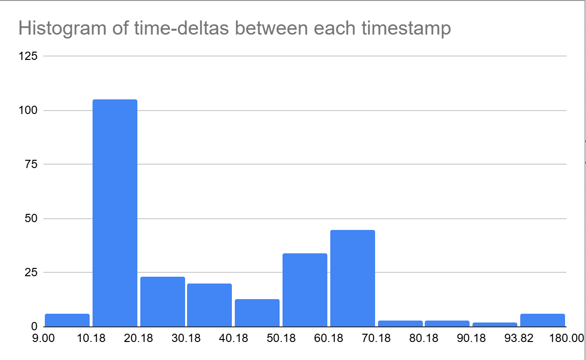

## imu

Graph of the distance over time for when I'm moving the box in front of the sensor back and forth:

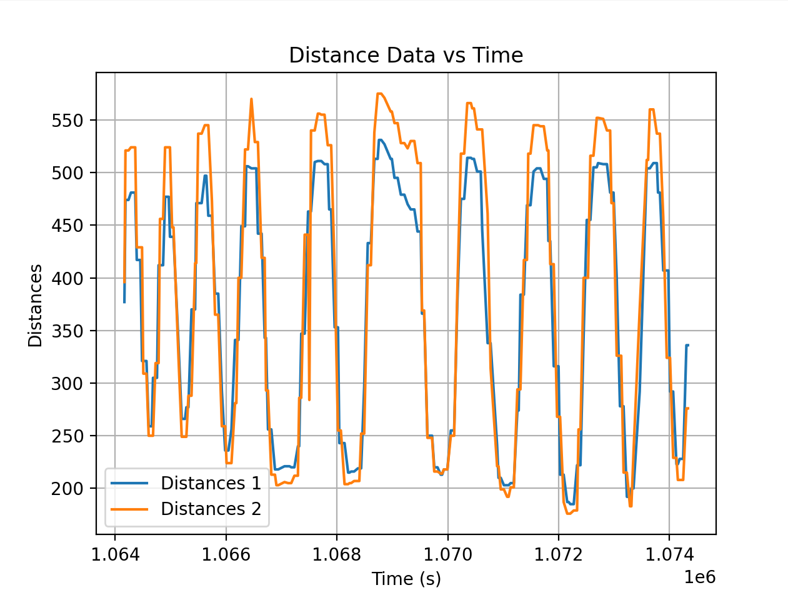

Graph of the accelerometer data over time for that same time period. This makes sense for me becaue the IMU is motionless. The next graph is the corresponding angles calculated from the accel data. 

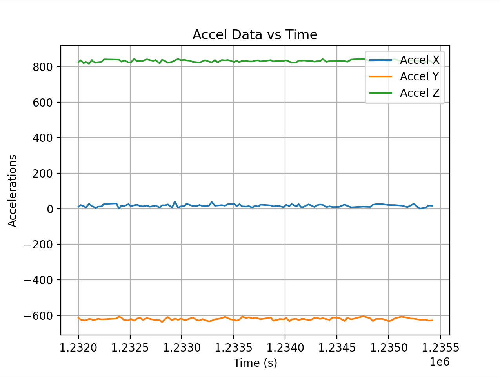


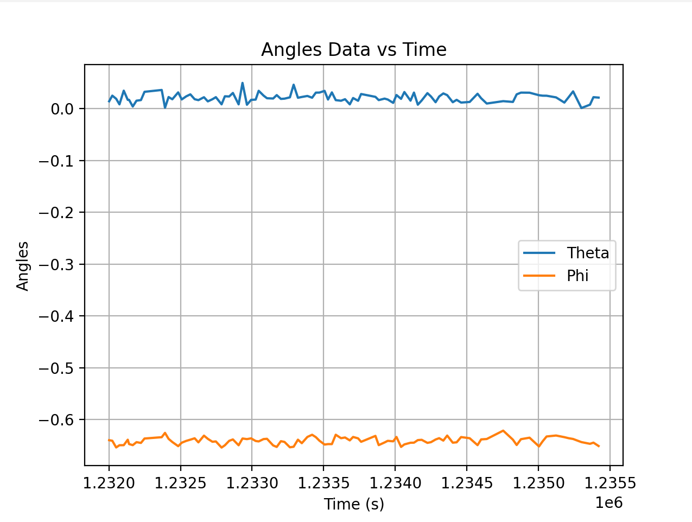

