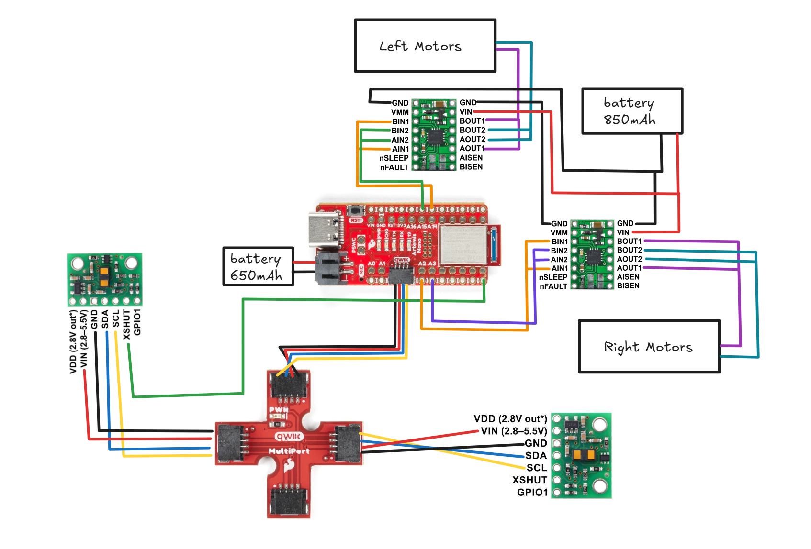
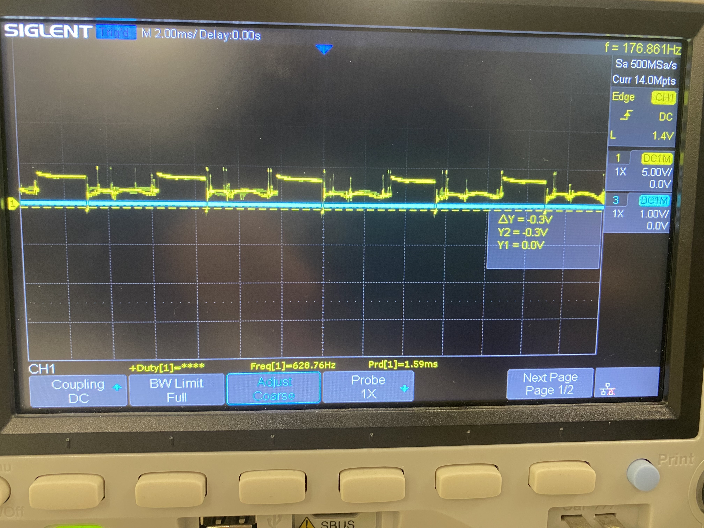
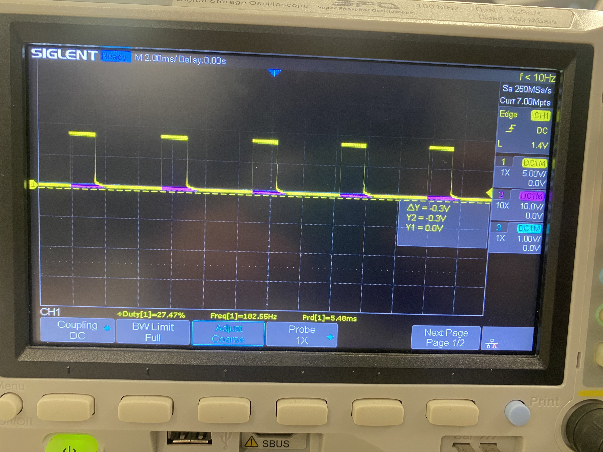
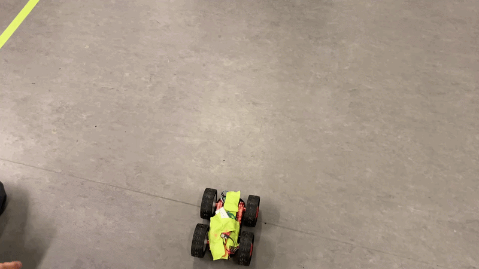
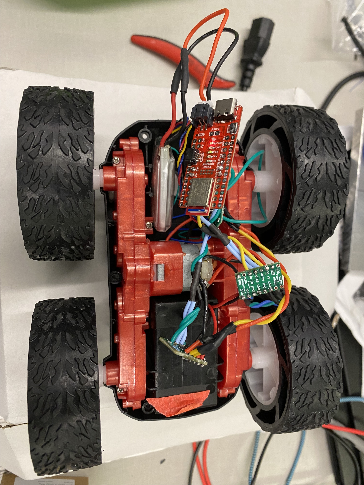

<script>
window.MathJax = {
  tex: {
    inlineMath: [['$', '$'], ['\\(', '\\)']],
    displayMath: [['$$','$$'], ['\\[','\\]']]
  }
};
</script>
<script src="https://cdn.jsdelivr.net/npm/mathjax@3/es5/tex-mml-chtml.js"></script>

[← Back to Home]({{ '/' | relative_url }})

## Contents
* [Prelab Tasks](#prelab)
* [Lab Tasks](#labtasks)
* [IMU](#imu)

---

## prelab 

### Debugging

The motor driver needs to use analog pins and I was planning to use analog pins on opposite sides of the Artemis so that I could put the motor drivers on either side of the Artemis and separate out the wires a little. I'm using pins 15 and 16 and pins 2 and 3 for the drivers. 

The Artemis and motor drivers are on separate batteries to prevent any transient voltage changes that come from the motor. At startup or stall the motor pulls a lot of voltage and that can mean that the Artemis has to underdraw voltage which can cause resets or just cause the board to stop functioning. In addition, motors create back-emf and that back-emf could go into the Artemis and mess with communication. General noise and electromagnetic interference can also be better mitigated if the power and grounds are kept separate from the motor. For wiring, it's important that the power lines stay as short as possible to prevent excessive resistance in the wires. Power should be red and ground should be black because that's the convention and I would be quite confused if it was the other way. The signal wires should be kept short as well and away from the power lines to prevent EMI. At the same time they shouldn't be too short and put under strain. The signal wires that are paired together (outputs, inputs) should be twisted together to shield it from external EMI. Solid core wire is unideal when the wires have to be flexible, which is definitely the case here so I used multicore wire for everything. 

### Power supply

We are using the DRV8833 Dual Motor Driver Carrier. On the spec sheet it says that it can take in a voltage of 2.7 V to 10.8 V. Following that, I supplied the motor driver a voltage of around 7V for a good middle ground of that range. 


### Wiring Diagram


around 50 the motors start spinning but this is free spin

I took my oscilloscope readings while plugged into the battery and while the motor was connected so there are a lot of transient voltage spikes that are probably a result of EMI and motor back-emf. 

Oscilloscope readings when motor was plugged in and spinning:


Oscilloscope readings of just the motor driver on the power source:


Regardless, the square wave for the PWM signal can be seen. To command the motors to spin, I used analogWrite commands to drive the following analog pins: 2, 3, 14, and 15. 

For the left side of the car, pin 2 drives the motors forward while pin 3 drives them backward. For the right side of the car, pin 14 drives the motors forward while pin 15 drives them backward. 

While in the air, they need to be commanded at least a value of 60 to get the wheels to spin. While on the ground, they need to be commanded at least a value of 90 to get the wheels to spin for turning straight. When turning I found that it was a little more forgiving for one motor to be above that threshhold and one motor to be below that threshhold as that would just mean it would do a quicker turn. 


#### Code
Setup
```C++
void setup() {
  Wire.begin();
  Serial.begin(115200);

  pinMode(LM_F, OUTPUT);
  pinMode(LM_B, OUTPUT);
  pinMode(RM_F, OUTPUT);
  pinMode(RM_B, OUTPUT);

  analogWrite(LM_F, 0);
  analogWrite(LM_B, 0);
  analogWrite(RM_F, 0);
  analogWrite(RM_B, 0);

  BLE.begin();
  BLE.setDeviceName("Artemis BLE");
  BLE.setLocalName("Artemis BLE");
  BLE.setAdvertisedService(testService);
  testService.addCharacteristic(tx_characteristic_float);
  testService.addCharacteristic(tx_characteristic_string);
  testService.addCharacteristic(rx_characteristic_string);
  BLE.addService(testService);
  tx_characteristic_float.writeValue(0.0);

  BLE.advertise();
  start_time = millis();
}
```

Loop
```C++
void loop() {
  if (millis() - start_time > 1500) {
    analogWrite(14, 0);
    delay(20);
    analogWrite(15, 200);
  } else {
    analogWrite(14, 200);
    delay(10);
  }
}
```

## Driving in a Straight Line


One motor spins slightly faster than each other so I had to mess with the PWM values a bit to get it to go straight. One PWM value is 10 more than the other to compensate. The code times out after 1.5 seconds so that the car doesn't get away from me too quickly.

```C++
void loop() {
  if (millis() - start_time > 1500) {
    analogWrite(LM_F, 0);
    analogWrite(RM_F, 0);
  } else {
    analogWrite(LM_F, 100);
    delay(10);
    analogWrite(RM_F, 110);
  }
}
```

## Curve



The strategy for this was just to have one motor spinning substantially faster than the other. One was at 150 and the other was at 250. The closer the PWM values of each side are, the more gradual the turn. The turn can be made quicker if one motor is stopped or if it is spinning the opposite way. 

```C++
void loop() {
  if (millis() - start_time > 1500) {
    analogWrite(LM_F, 0);
    analogWrite(RM_F, 0);
  } else {
    analogWrite(LM_F, 150);
    delay(10);
    analogWrite(RM_F, 250);
  }
}
```

## Wiring Picture

Robot wiring:



## Open Loop Control

 

```C++
void loop() {
  if (millis() - start_time > 2000) {
    analogWrite(14, 0);
    delay(20);
    analogWrite(15, 0);
    analogWrite(2, 0);
    analogWrite(3, 0);
  } else {
    analogWrite(14, 200);
    analogWrite(2, 200);
    delay(100);
    analogWrite(2, 100);
    delay(100);
    analogWrite(2, 0);
    analogWrite(14, 0);
    delay(100);
    analogWrite(14, 220);
    delay(100);
    analogWrite(2, 220);
  }
```