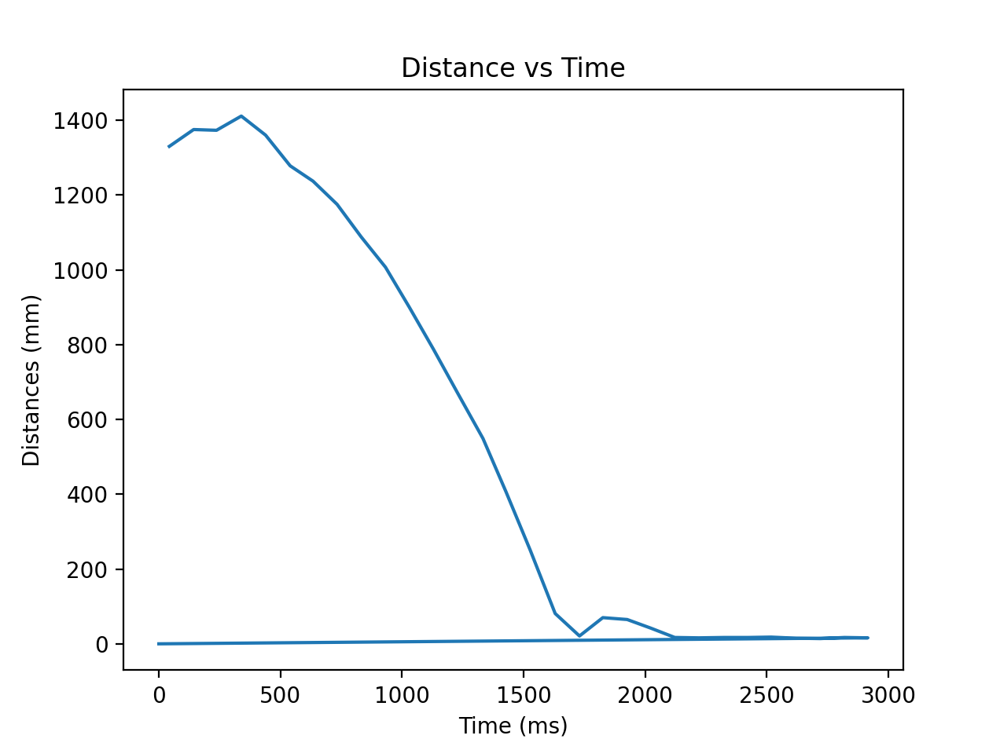
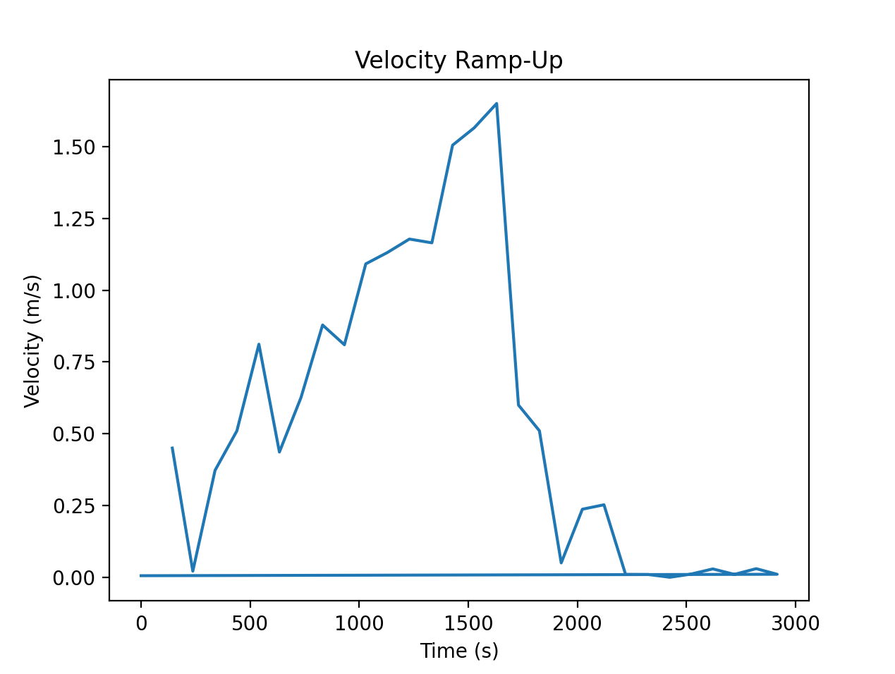
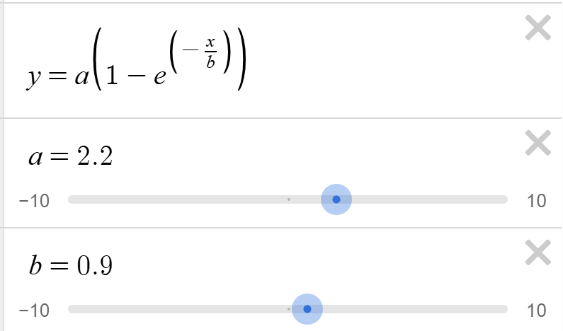
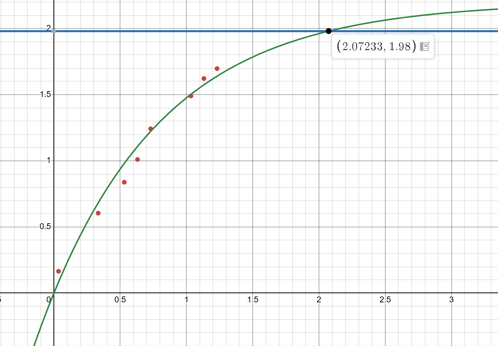
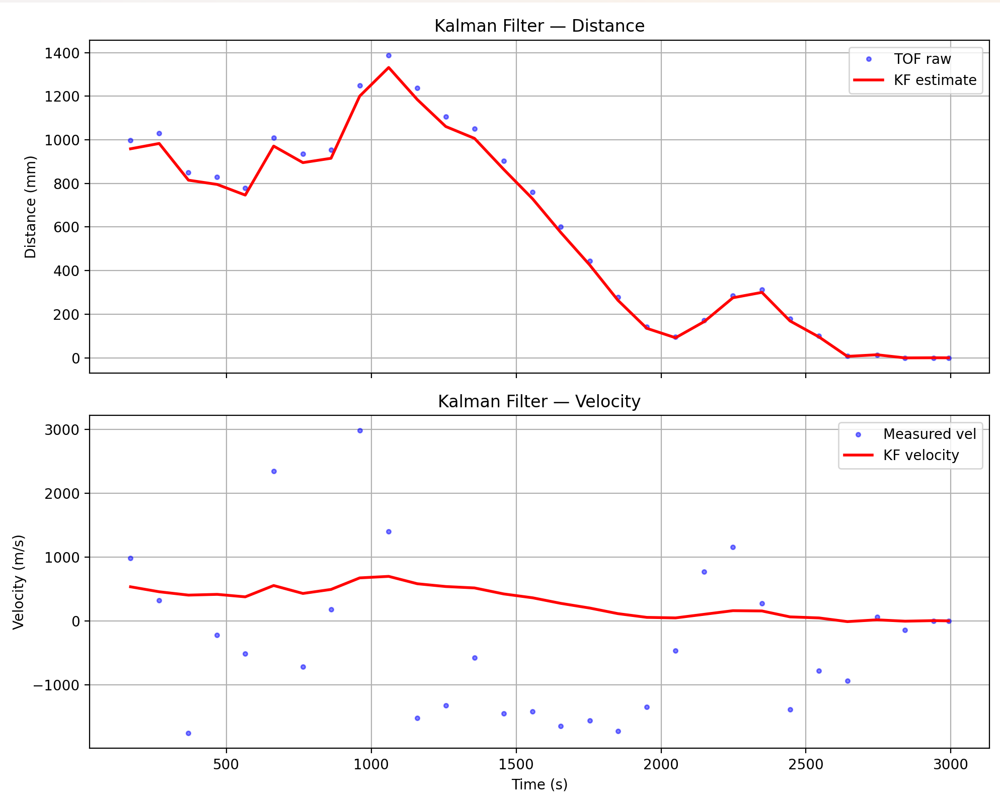
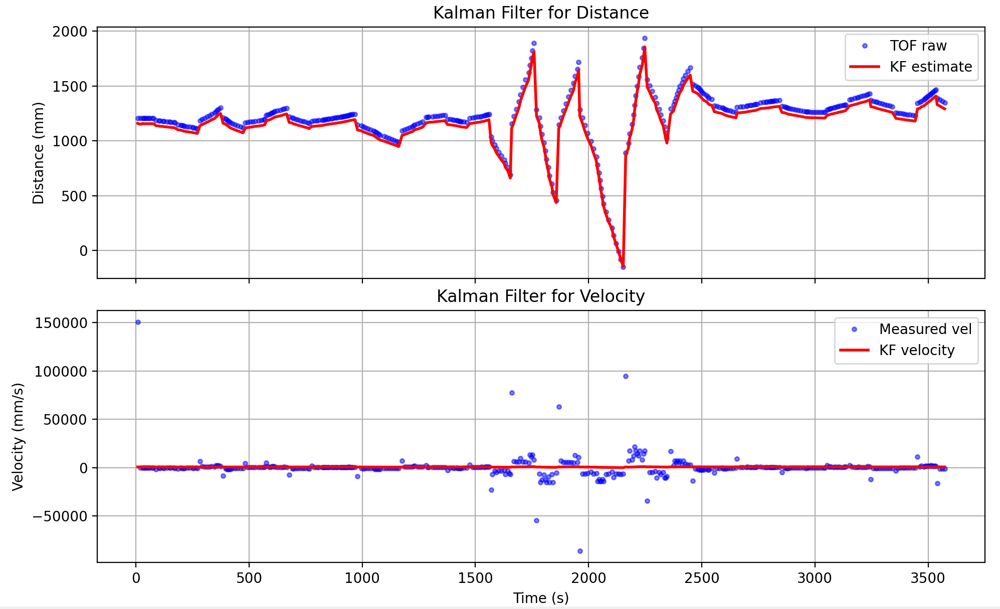
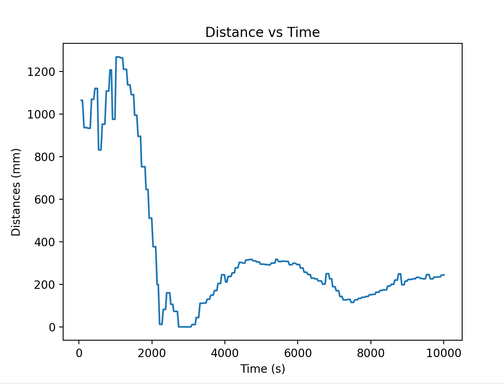
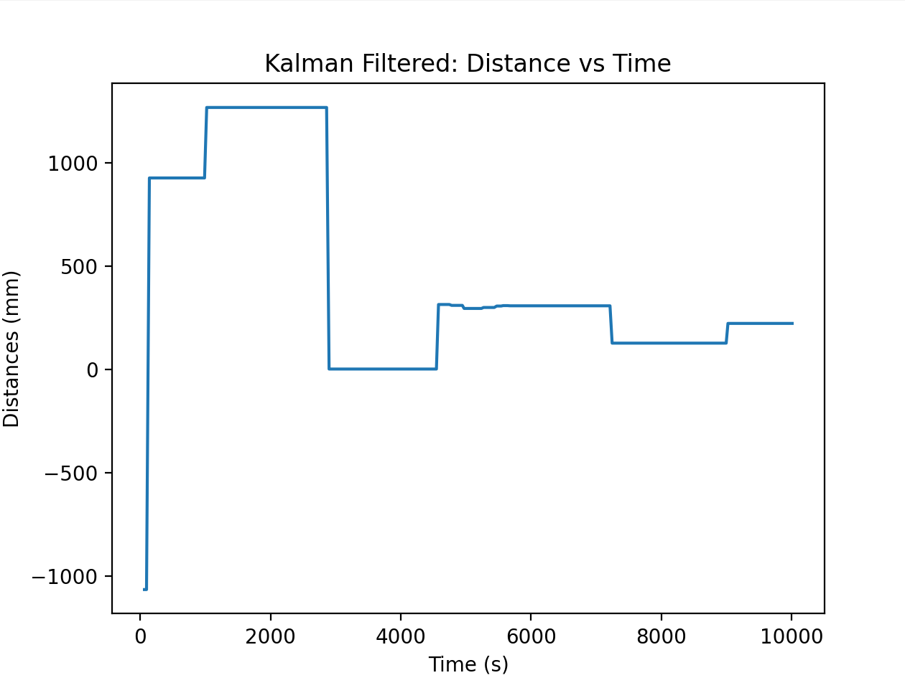

<script>
window.MathJax = {
  tex: {
    inlineMath: [['$', '$'], ['\\(', '\\)']],
    displayMath: [['$$','$$'], ['\\[','\\]']]
  }
};
</script>
<script src="https://cdn.jsdelivr.net/npm/mathjax@3/es5/tex-mml-chtml.js"></script>

[← Back to Home]({{ '/' | relative_url }})

## Contents
* [Prelab Tasks](#prelab)
* [Lab Tasks](#labtasks)

## prelab

### Getting Motor Momentum and Drag


My first appraoch was to take distance readings whenever data is ready and then to take the delta distance / delta time to get velocity and send over bluetooth. This worked partially but the main issue I ran into is that the values were excessively high (pretty sure my car is not 6 m/s) and I ended up with wildly fluctuating values. I think the issue with that if the distance or time measurements fall behind or are updating faster than the other, it throw off my data significantly. I switched to doing the math in python instead and just getting raw distance and time values. 

Laggy:
```C++
void drive(float u) {
  analogWrite(LM_F, u);
  analogWrite(LM_B, 0);
  analogWrite(RM_F, u);
  analogWrite(RM_B, 0);
  unsigned long startTime = millis();
  while (!distanceSensor.checkForDataReady()) {}
  prev_distance = distanceSensor.getDistance();
  distanceSensor.clearInterrupt();
  prev_time = millis();

  while (millis() - startTime < 3000) {
    unsigned long now = millis();

    if ((now - prev_time) >= 25 && distanceSensor.checkForDataReady()) {
      float distance = distanceSensor.getDistance();
      distanceSensor.clearInterrupt(); 

      float dd = distance - prev_distance;      
      float dt_ms = (float)(now - prev_time);

      if (log_index < MAX_SAMPLES) {
        velocity_meas[vel_index++] = dd / dt_ms;  
        dist_log[log_index] = distance;
        time_log[log_index] = now - startTime;
        u_log[log_index] = u;
        log_index++;
      }

      prev_distance = distance;
      prev_time = now;                           
    }
  }
  stop();
}
```

Once I had my velocity values I graphed the distance and the velocity versus time as seen below. 

 

 

A lot of the data was before the ramp up or data from after the robot hit the wall so I got the data from the csv and then filtered out the bad data. I initially tried MATLAB's cuve fit program but I had trouble refining the parameters so I ended up putting it into desmos and visually curve fitting to get tau and m. 

CSV data code (used pandas): 
```python
df = pd.DataFrame({
    'time_ms': times,
    'distance_mm': distances,
    'vel': velocity
})

df.to_csv('step_response.csv', index=False)
```

 

The final value for m was 2.2 m/s and tau = 0.9. I then got the 90% rise value which was 1.98 m/s and checked the time corresponding to that, which was 2.072 seconds. 

 

I then used the formulas for d and m to calculate my values (didn't calculate the raw values, just put the formulas into python). I used those values to get my A, B, and C matricies. 

$$
d = \frac{u}{dx}
$$

$$
m =  \frac{- d \cdot t(0.9)}{ln(0.1)}
$$

$$A = \begin{bmatrix} 0 & 1 \\ 0 & -d/m \end{bmatrix}, \quad B = \begin{bmatrix} 0 \\ 1/m \end{bmatrix}, \quad C = \begin{bmatrix} -1 & 0 \end{bmatrix}$$


### Initialize KF in Python

I used my computed A and B matricies to get my Ad and Bd matricies for use in my Kalman Filter:

$$A_d = I + \Delta T \cdot A, \quad B_d = \Delta T \cdot B$$

As well as initialized my x vector with 0 velocity and the first distance reading sent by Arduino. 

#### Process Noise

My process noise is based on my sampling rate. My TOF sensor is set so that 

```C++
distanceSensor.setDistanceModeLong();
distanceSensor.setTimingBudgetInMs(20); 
```

so my delta_T is 20 ms. I use that in the noise equations for uncertainty in position and speed: 

$$\sigma_1 = \sqrt{10^2 \cdot \frac{1}{\Delta T}}$$

$$\sigma_2 = \sqrt{10^2 \cdot \frac{1}{\Delta T}}$$

to get the matrix for process noise:

$$\Sigma_u = \begin{bmatrix} \sigma_1^2 & 0 \\ 0 & \sigma_2^2 \end{bmatrix}$$

#### Measurement Noise

My measurement noise is based on the values in the slides:

$$\sigma_3 = 20 \text{ mm}$$$$

$$\Sigma_z = \sigma_3^2$$

I then use all of these values into the math for the Kalman Filter

```python
def kf(mu,sigma,u,y):
    
    mu_p = A.dot(mu) + B.dot(u) 
    sigma_p = A.dot(sigma.dot(A.transpose())) + sigma_u
    
    sigma_m = C.dot(sigma_p.dot(C.transpose())) + sigma_z
    kkf_gain = sigma_p.dot(C.transpose().dot(np.linalg.inv(sigma_m)))

    y_m = y-C.dot(mu_p)
    mu = mu_p + kkf_gain.dot(y_m)    
    sigma=(np.eye(2)-kkf_gain.dot(C)).dot(sigma_p)

    return mu, sigma
```

### Implemented Kalman Filter

Here's a comparison (for open loop control still) of my distance and velocity recordings against the Kalman filtered values. For the most part I didn't have to change the parameters of my Kalman filter which was awesome actually because it tracks my data pretty well. I did do some data formatting (check for zeros and then mask all my arrays to eliminate those, make sure all arrays are the same length, and I had to make a few corrections because of unit mismatch both between the filter and the raw data and also just generally when processing my data).

 

I then ran essentially my Lab 5 PID control but with the Kalman filter in Python. Same parameters as open loop control for this as well. I ended up tweaking the PID control a bit and I got a very interesting run where the car was oscillating back and forth which I included here mostly to show the effectiveness of the filter. 

 


### Kalman Filtering On Robot

For this step I reused a lot of the math previously done in python just converted into C++ syntax. I imported the linear algebra library and initialized a lot of my matricies as well as an 2X2 Identity matrix. 

```C++
#include <BasicLinearAlgebra.h>
using namespace BLA;

Matrix<2,2> Ad;

Matrix<2,1> Bd;

Matrix<1,2> C;

Matrix<2,2> Sigma_u;
Matrix<1,1> Sigma_z;

Matrix<2,1> x_kf;
Matrix<2,2> sig_kf;
Matrix<2,2> I = {1.0, 0.0,
                 0.0, 1.0};

```

I then set the physical values of them in setup:

```C++
float v_90 = 2.2*0.9;
  float t_90 = 2.07233;
  float d = 100/v_90;
  float m = (-d*t_90) / log(0.1);

  Matrix<2,2> A = {0.0,1,
      0.0,-d/m};

  Matrix<2,1> B = {0.0,1.0/m};

  C  = {1.0, 0.0};

  float Delta_T = 25.0f/1000f;

  Ad = I + Delta_T * A;
  Bd = Delta_T * B;

  float sigma_1 = sqrt((10.0*10.0)/0.025);  
  float sigma_2 = sqrt((10.0*10.0)/0.025);

  Sigma_u = {sigma_1*sigma_1, 0, 0, sigma_2*sigma_2};

  Sigma_z = {400};
  sig_kf = {1.0, 0.0, 0.0, 1.0};
```

My PID control was very similar to Lab 5 (reused the same P,I,and D values) except no linear interpolation. In order to preven drift from the sensor sampling at uneven times, I enforced the 25 ms sampling speed by only allowing the loop to run every time 25ms passed. I use the Kalman Filter to get a new x vector and then use the distance from that x vector to calculate PID values (with the same method as Lab 5). If the distance doesn't update it reuses the last distance value but that shouldn't happen because my sampling rate is 25 ms for the loop while the sensor's should theoretically be 20 ms. 

```C++
void handlePID() {
  kf_initialized = false;
  current_u = 0.0;
  log_index = 0;       
  integral = 0;         
  prev_error = 0;      
  prev_time = millis(); 
  double raw_dist = distanceSensor.getDistance();
  double startTime = millis();
  boolean updated = distanceSensor.checkForDataReady();
  unsigned long lastKF = millis();

  while (millis() - startTime < 10000) {
    updated = distanceSensor.checkForDataReady();
    if (updated) {
      raw_dist = distanceSensor.getDistance();
      distanceSensor.clearInterrupt();
    }

    if (millis() - lastKF >= 25) {
      kalmanFilter(current_u, raw_dist, updated);

      float kf_distance = x_kf(0);   
      float u = computePID(kf_distance);
      current_u = u;

      if (u > 255) u = 250;
      if (u < -255) u = -250;
      if (u > 0) {
        analogWrite(LM_F, u); 
        analogWrite(RM_F, u);
        analogWrite(LM_B, 0); 
        analogWrite(RM_B, 0);
      } else {
        analogWrite(LM_F, 0); 
        analogWrite(RM_F, 0);
        analogWrite(LM_B, -u); 
        analogWrite(RM_B, -u);
      }

      if (log_index < MAX_SAMPLES) {
        dist_log[log_index] = raw_dist;
        dist_kf_log[log_index] = kf_distance;
        time_log[log_index] = millis() - startTime;
        u_log[log_index] = u;
        log_index++;
      }
      lastKF = millis();
    }
  }
  stop();
}
```

My Kalman Filter method is pretty much the same logic as the python one. If the distance is not updated, there is no filtering to be done so it just passes back the same x vector and noise. Otherwise I calculate a new x vector and then the PID math uses that new x vector's distance to calculate the u-value. 

```C++
void kalmanFilter(float u_pwm, float raw_dist, bool updated) {

  if (!kf_initialized) {
    x_kf(0) = raw_dist;
    x_kf(1) = 0.0;
    kf_initialized = true;
    return;
  }

  float u_norm = u_pwm / 100.0;

  Matrix<2,1> mu_p = Ad * x_kf + Bd * u_norm;
  Matrix<2,2> sigma_p = Ad * sig_kf * ~Ad + Sigma_u;

  if (updated) {
    Matrix<1,1> sigma_m = C * sigma_p * ~C + Sigma_z;
    Matrix<2,1> kf_gain = sigma_p * ~C * Inverse(sigma_m);

    float y = raw_dist;
    float y_m = y - (C * mu_p)(0);

    x_kf = mu_p + kf_gain * y_m;
    sig_kf = (I - kf_gain * C) * sigma_p;
  } else {
    x_kf = mu_p;
    sig_kf = sigma_p;
  }
}
```

I then send the data to python and then graph the filtered distance and velocity and the raw distance and velocity. 

Raw data: 
 

Filtered data: 
 

#### Videos

Will put in a bit, I'm so sorry!! 


