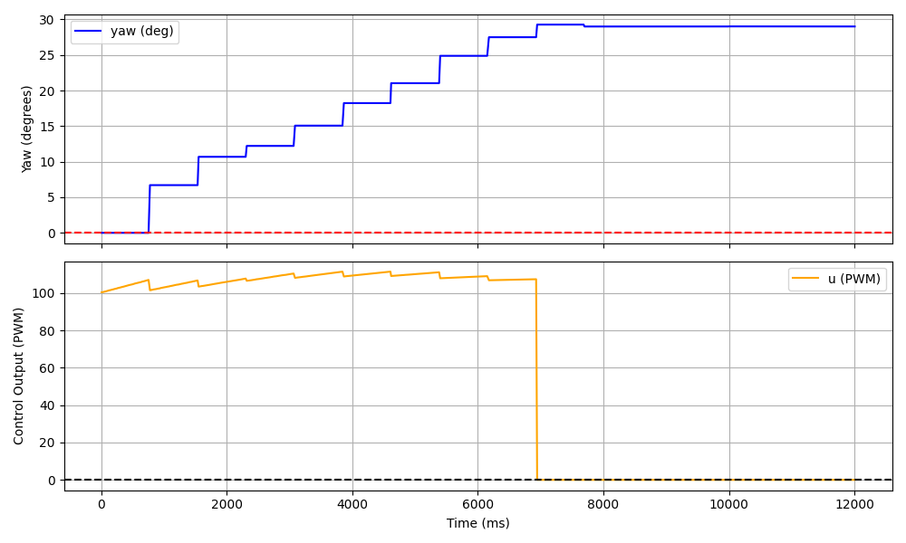
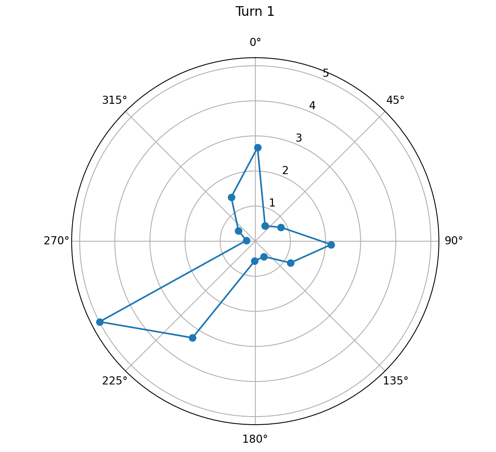
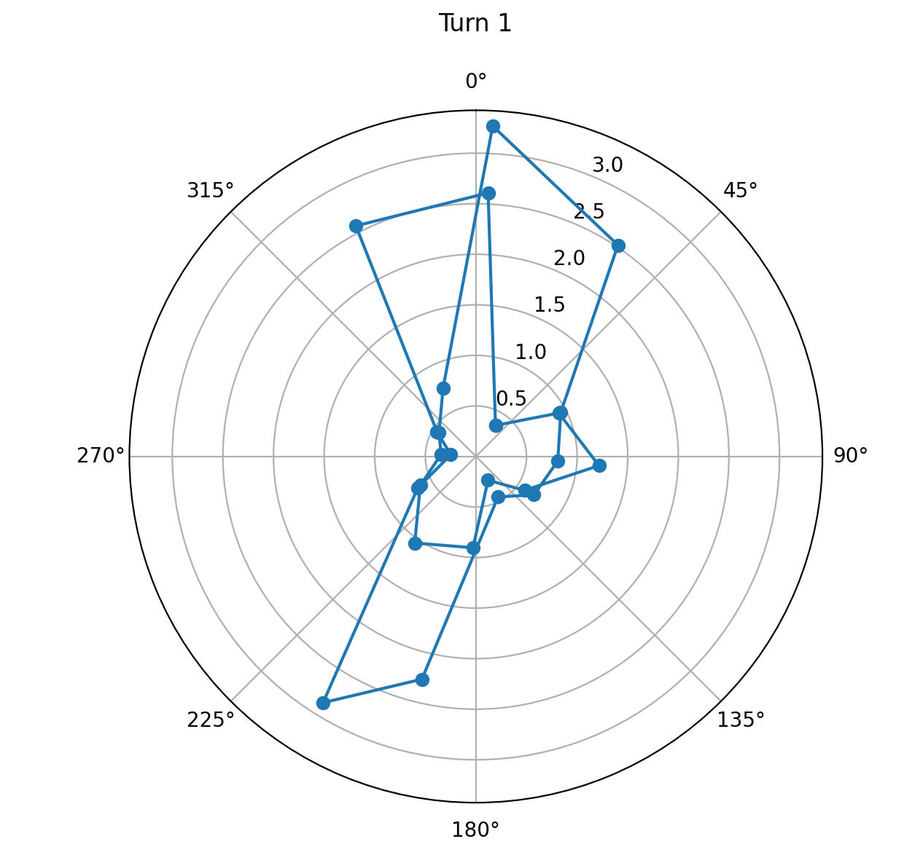

<script>
window.MathJax = {
  tex: {
    inlineMath: [['$', '$'], ['\\(', '\\)']],
    displayMath: [['$$','$$'], ['\\[','\\]']]
  }
};
</script>
<script src="https://cdn.jsdelivr.net/npm/mathjax@3/es5/tex-mml-chtml.js"></script>

[← Back to Home]({{ '/' | relative_url }})


##  Approach 

I decided to do orientation PID control because I had got it working fairly well for Lab 6 and I thought that it would help me stop at each angle and take my time of flight recording. I continued to use the DMP for this lab but I found two big issses: I kept forgetting to clear the queue for the data readings so I was getting weird values and my data rate was set at 100 Hz, which was too fast and caused me to get weird values. I made sure to clear the FIFO queue every time I commanded a new angle and I changed the data rate line to "success &= (myICM.setDMPODRrate(DMP_ODR_Reg_Quat6, 43) == ICM_20948_Stat_Ok);"

I also went from Quat9 (which I used for Lab 6) to Quat6 for this lab. I was testing a lot in Upson and I noticed that I was getting a bunch of inconsistencies where the robot was not reading the same angle in the same place every time at a fixed setpoint. I finally decided this was because of EMI causing the magnetometer readings to be flawed. Although switching to Quat6 does increase the risk of gyro drift I decided this wasn't a big issue because I'm doing small angle increments and I'm realistically not doing more than 2 turns in one location. 

My orientation PID calculation method from Lab6 was virtually unmodified. I just changed the logic in the method that calls it so that it would cycle through the different angle spacings and also track the distance. I tracked the distance in two places, first in the PID method so that every time I get the u values I would get the distance values. This was to create the continuous distance plot shown in the lab. Mine came out fairly consistently because my robot turns quite slowly. I also tracked the distance after every new angle call so that I could get data pairs of (angle, distance) for use in the polar plot and the room mapping. 


My PID methods for reference:

```C++
float computeOrientationPID(float measured_yaw, float gyrZ_now) {
  unsigned long now = millis();
  float dt = (float)(now - prev_time) / 1000.0f;
  float df_alpha = 0.8;
  prev_time = now;
  if (dt <= 0) dt = 0.001f;  
  //measured_yaw = measured_yaw + gyrZ_now*dt;
  //yaw = measured_yaw;
  if (setpoint >= 360) {
    setpoint = fmod(setpoint, 360);
  }
  float error = setpoint - measured_yaw;
  if (abs(error) <= 2) {
    //integral = 0;
    return 0;
  }
  while (error >  180.0f) error -= 360.0f;
  while (error < -180.0f) error += 360.0f;

  integral += error * dt;
  integral  = constrain(integral, -200.0f, 200.0f);

  yfiltered_d = (1 - df_alpha) * yfiltered_d + (df_alpha) * gyrZ_now;  
  float u = Kp * error + Ki * integral - Kd * yfiltered_d;
  return u;
}
```

PID handler method
```C++
void handleOrientationPID() {
  Serial.println("Starting Orientation PID");
  while (setpoint >  180.0f) setpoint -= 360.0f;
  while (setpoint < -180.0f) setpoint += 360.0f;
  
  integral = 0;
  prev_error = 0;
  
  prev_time = millis();
  unsigned long startTime = millis();
  
  float scaled_u = 0;

  while (millis() - startTime < 15000) {   
    
    check_DMP();
    myICM.getAGMT(); 
    float relative_yaw = yaw - yaw_offset;
    while (relative_yaw >  180.0f) relative_yaw -= 360.0f;
    while (relative_yaw < -180.0f) relative_yaw += 360.0f;
    float u = computeOrientationPID(relative_yaw, myICM.gyrZ());
    //float u = computeOrientationPID(yaw, myICM.gyrZ() - gyrZ_bias);


    const float MIN_SPEED = 75.0;
    //scaled_u = (1 - (abs(u)/255)) * (255 - MIN_SPEED) + MIN_SPEED;

    if (abs(u) > 0 && abs(u) < 255) {
      scaled_u = MIN_SPEED + (abs(u) / 255.0f) * (255.0f - MIN_SPEED);
      u = scaled_u * (u > 0 ? 1.0f : -1.0f);
    }

    u = constrain(u, -255, 255);

    drive(u, 0);

    if (log_index < MAX_SAMPLES) {
        //Serial.println("where tf is this going");
        yaw_log[log_index] = relative_yaw;
        //Serial.println(yaw);
        time_log[log_index] = millis() - startTime;
        u_log[log_index] = u;
        cont_dist_log[log_index] = distanceSensor.getDistance();
        log_index++;
    }
  }
  stop();
}
```

Python call to cycle through angles:
```C++
case TO_ORIENTATION:
  float python_orientation;
  yaw = 0.0;
  dist_log_index = 0;
  log_index = 0;
  myICM.resetFIFO();
  while (!check_DMP());  // wait for first real reading
  yaw_offset = yaw;
  setpoint = 0;
  for (int i = 0; i < 6; i++) {
    setpoint+=30;
    handleOrientationPID();
    Serial.print("yaw: ");
    Serial.println(yaw);
    dist_log[dist_log_index] = distanceSensor.getDistance();
    angle_log[dist_log_index] = yaw;
    dist_log_index++;

    myICM.resetFIFO();

  }
  setpoint = -180
  for (int i = 0; i < 6; i++) {
    setpoint+=30;
    handleOrientationPID();
    Serial.print("yaw: ");
    Serial.println(yaw);
    dist_log[dist_log_index] = distanceSensor.getDistance();
    angle_log[dist_log_index] = yaw;
    dist_log_index++;
    myICM.resetFIFO();

  }
  break;
}
```

The main things I had to do in python was PID tuning and graphing. I started with a Kp values of 1 and Kd and Ki values of 0 and tuned it for just one angle (60 degrees). I had to increase the Kp value a little to reduce my rise time so I could just get to my angle target faster. I ended up having a fairly large steady state error (consistently hitting like 44 degrees) so I increased my Ki values substantially. My deadband was +- 1 degree so I just aimed to get somewhere in that range. I didn't have to adjust my derivative control. My final values were Kp = 1.2, Ki = 0.42, Kd = 0. 


Plotting for PID control values:

 

```python
fig, (ax1, ax2) = plt.subplots(2, 1, figsize=(10, 6), sharex=True)
    
ax1.plot(time_vals, yaw_vals, label='yaw (deg)', color='blue')
ax1.axhline(y=0, color='red', linestyle='--')
ax1.set_ylabel('Yaw (degrees)')
ax1.legend()
ax1.grid(True)
    
ax2.plot(time_vals, u_vals, label='u (PWM)', color='orange')
ax2.axhline(y=0, color='black', linestyle='--')
ax2.set_ylabel('Control Output (PWM)')
ax2.set_xlabel('Time (ms)')
ax2.legend()
ax2.grid(True)
    
plt.tight_layout()
plt.show()

plt.figure()
plt.plot(time_vals, dist_vals)
plt.xlabel("Time (ms)")
plt.ylabel("TOF Data (mm)")
plt.title("TOF Data from 1 turn")
plt.show()
```

Polar plotting code:

One rotation:
 

Two rotations: It doesn't line up super well in two places and that's because my robot isn't turning on axis. After even just one turn the ending position is a little ahead of the starting position, and it shows during the second turn. Part of the issue is also that I'm one of the distance targets the robot detected and I'm pretty sure I accidentally moved while it did the scan. 
 


```python
angles_rad = np.radians(angle_vals)
distances_m = np.array(dist_vals)/1000.0
    
fig, (ax1,ax2) = plt.subplots(1, 2, figsize=(14, 6),subplot_kw={'projection': 'polar'})
    
for ax, title in zip([ax1, ax2], ['Turn 1', 'Turn 2']):
    ax.plot(np.append(angles_rad, angles_rad[0]),np.append(distances_m, distances_m[0]),'o-', linewidth=1.5)
    ax.set_theta_zero_location('N')
    ax.set_theta_direction(-1)
    ax.set_title(title, pad=20)
plt.tight_layout()
plt.show()
```

Code for mapping the area, based on the slides from class. 

```python
#will put in soon
```

