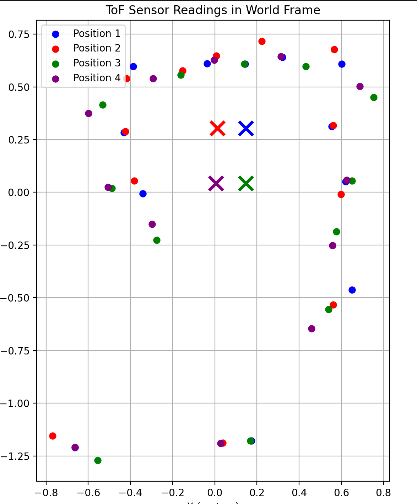

<script>
window.MathJax = {
  tex: {
    inlineMath: [['$', '$'], ['\\(', '\\)']],
    displayMath: [['$$','$$'], ['\\[','\\]']]
  }
};
</script>
<script src="https://cdn.jsdelivr.net/npm/mathjax@3/es5/tex-mml-chtml.js"></script>

[← Back to Home]({{ '/' | relative_url }})


##  Approach 

I decided to do orientation PID control because I had got it working fairly well for Lab 6 and I thought that it would help me stop at each angle and take my time of flight recording. I continued to use the DMP for this lab but I found two big issses: I kept forgetting to clear the queue for the data readings so I was getting weird values and my data rate was set at 100 Hz, which was too fast and caused me to get weird values. I made sure to clear the FIFO queue every time I commanded a new angle and I changed the data rate line to "success &= (myICM.setDMPODRrate(DMP_ODR_Reg_Quat6, 43) == ICM_20948_Stat_Ok);"

I also went from Quat9 (which I used for Lab 6) to Quat6 for this lab. I was testing a lot in Upson and I noticed that I was getting a bunch of inconsistencies where the robot was not reading the same angle in the same place every time at a fixed setpoint. I finally decided this was because of EMI causing the magnetometer readings to be flawed. Although switching to Quat6 does increase the risk of gyro drift I decided this wasn't a big issue because I'm doing small angle increments and I'm realistically not doing more than 2 turns in one location. 

My orientation PID calculation method from Lab6 was virtually unmodified. I just changed the logic in the method that calls it so that it would cycle through the different angle spacings and also track the distance. I tracked the distance in two places, first in the PID method so that every time I get the u values I would get the distance values. This was to create the continuous distance plot shown in the lab. Mine came out fairly consistently because my robot turns quite slowly. I also tracked the distance after every new angle call so that I could get data pairs of (angle, distance) for use in the polar plot and the room mapping. 


My PID methods for reference:

```C++
float computeOrientationPID(float measured_yaw, float gyrZ_now) {
  unsigned long now = millis();
  float dt = (float)(now - prev_time) / 1000.0f;
  float df_alpha = 0.8;
  prev_time = now;
  if (dt <= 0) dt = 0.001f;  
  //measured_yaw = measured_yaw + gyrZ_now*dt;
  //yaw = measured_yaw;
  if (setpoint >= 360) {
    setpoint = fmod(setpoint, 360);
  }
  float error = setpoint - measured_yaw;
  if (abs(error) <= 2) {
    //integral = 0;
    return 0;
  }
  while (error >  180.0f) error -= 360.0f;
  while (error < -180.0f) error += 360.0f;

  integral += error * dt;
  integral  = constrain(integral, -200.0f, 200.0f);

  yfiltered_d = (1 - df_alpha) * yfiltered_d + (df_alpha) * gyrZ_now;  
  float u = Kp * error + Ki * integral - Kd * yfiltered_d;
  return u;
}
```

PID handler method
```C++
void handleOrientationPID() {
  Serial.println("Starting Orientation PID");
  while (setpoint >  180.0f) setpoint -= 360.0f;
  while (setpoint < -180.0f) setpoint += 360.0f;
  
  integral = 0;
  prev_error = 0;
  
  prev_time = millis();
  unsigned long startTime = millis();
  
  float scaled_u = 0;

  while (millis() - startTime < 15000) {   
    
    check_DMP();
    myICM.getAGMT(); 
    float relative_yaw = yaw - yaw_offset;
    while (relative_yaw >  180.0f) relative_yaw -= 360.0f;
    while (relative_yaw < -180.0f) relative_yaw += 360.0f;
    float u = computeOrientationPID(relative_yaw, myICM.gyrZ());
    //float u = computeOrientationPID(yaw, myICM.gyrZ() - gyrZ_bias);


    const float MIN_SPEED = 75.0;
    //scaled_u = (1 - (abs(u)/255)) * (255 - MIN_SPEED) + MIN_SPEED;

    if (abs(u) > 0 && abs(u) < 255) {
      scaled_u = MIN_SPEED + (abs(u) / 255.0f) * (255.0f - MIN_SPEED);
      u = scaled_u * (u > 0 ? 1.0f : -1.0f);
    }

    u = constrain(u, -255, 255);

    drive(u, 0);

    if (log_index < MAX_SAMPLES) {
        //Serial.println("where tf is this going");
        yaw_log[log_index] = relative_yaw;
        //Serial.println(yaw);
        time_log[log_index] = millis() - startTime;
        u_log[log_index] = u;
        cont_dist_log[log_index] = distanceSensor.getDistance();
        log_index++;
    }
  }
  stop();
}
```

Python call to cycle through angles:
```C++
case TO_ORIENTATION:
  float python_orientation;
  yaw = 0.0;
  dist_log_index = 0;
  log_index = 0;
  myICM.resetFIFO();
  while (!check_DMP());  // wait for first real reading
  yaw_offset = yaw;
  setpoint = 0;
  for (int i = 0; i < 6; i++) {
    setpoint+=30;
    handleOrientationPID();
    Serial.print("yaw: ");
    Serial.println(yaw);
    dist_log[dist_log_index] = distanceSensor.getDistance();
    angle_log[dist_log_index] = yaw;
    dist_log_index++;

    myICM.resetFIFO();

  }
  setpoint = -180
  for (int i = 0; i < 6; i++) {
    setpoint+=30;
    handleOrientationPID();
    Serial.print("yaw: ");
    Serial.println(yaw);
    dist_log[dist_log_index] = distanceSensor.getDistance();
    angle_log[dist_log_index] = yaw;
    dist_log_index++;
    myICM.resetFIFO();

  }
  break;
}
```

The main things I had to do in python was PID tuning and graphing. I started with a Kp values of 1 and Kd and Ki values of 0 and tuned it for just one angle (60 degrees). I had to increase the Kp value a little to reduce my rise time so I could just get to my angle target faster. I ended up having a fairly large steady state error (consistently hitting like 44 degrees) so I increased my Ki values substantially. My deadband was +- 1 degree so I just aimed to get somewhere in that range. I didn't have to adjust my derivative control. My final values were Kp = 1.2, Ki = 0.42, Kd = 0. 


Plotting for PID control values:

 

```python
fig, (ax1, ax2) = plt.subplots(2, 1, figsize=(10, 6), sharex=True)
    
ax1.plot(time_vals, yaw_vals, label='yaw (deg)', color='blue')
ax1.axhline(y=0, color='red', linestyle='--')
ax1.set_ylabel('Yaw (degrees)')
ax1.legend()
ax1.grid(True)
    
ax2.plot(time_vals, u_vals, label='u (PWM)', color='orange')
ax2.axhline(y=0, color='black', linestyle='--')
ax2.set_ylabel('Control Output (PWM)')
ax2.set_xlabel('Time (ms)')
ax2.legend()
ax2.grid(True)
    
plt.tight_layout()
plt.show()

plt.figure()
plt.plot(time_vals, dist_vals)
plt.xlabel("Time (ms)")
plt.ylabel("TOF Data (mm)")
plt.title("TOF Data from 1 turn")
plt.show()
```

Polar plotting code:

One rotation:
 

Two rotations: It doesn't line up super well in two places and that's because my robot isn't turning on axis. After even just one turn the ending position is a little ahead of the starting position, and it shows during the second turn. Part of the issue is also that I'm one of the distance targets the robot detected and I'm pretty sure I accidentally moved while it did the scan. 
 


```python
angles_rad = np.radians(angle_vals)
distances_m = np.array(dist_vals)/1000.0
    
fig, (ax1,ax2) = plt.subplots(1, 2, figsize=(14, 6),subplot_kw={'projection': 'polar'})
    
for ax, title in zip([ax1, ax2], ['Turn 1', 'Turn 2']):
    ax.plot(np.append(angles_rad, angles_rad[0]),np.append(distances_m, distances_m[0]),'o-', linewidth=1.5)
    ax.set_theta_zero_location('N')
    ax.set_theta_direction(-1)
    ax.set_title(title, pad=20)
plt.tight_layout()
plt.show()
```

Code for mapping the area, based on the slides from class. 

```python
from ble import get_ble_controller
from base_ble import LOG
from cmd_types import CMD
import time
import numpy as np
import matplotlib.pyplot as plt
import matplotlib.animation as animation
import math
import csv
import pandas as pd

# with reference to the center of the robot, the sensor is in front generally centered and straight
off_x = 0.08   
off_y = 0.00   
ang = 0.0    

def T_sensor_to_robot(tx, ty, alpha):
    return np.array([[np.cos(alpha),-np.sin(alpha),tx], [np.sin(alpha),np.cos(alpha),ty], [0,0,1]])

def T_robot_to_world(rx, ry, theta):
    theta_rad = np.radians(theta)
    return np.array([[np.cos(theta_rad),-np.sin(theta_rad),rx], [np.sin(theta_rad),np.cos(theta_rad),ry], [0,0,1]])

robot_positions = [
    (148/1000,(345-42)/1000),# position 1
    (12/1000,(345-42)/1000),# position 2
    (148/1000,42/1000),# position 3
    (6/1000,42/1000),# position 4
]

colors = ['blue','red','green','purple']
labels = ['Position 1','Position 2','Position 3','Position 4']

all_data = [
    [(1.421, 327), (34.012, 467), (62.937, 299), (90.791, 226), (121.028, 279),
     (151.229, 530), (-178.017, 499), (-147.668, 499), (-118.174, 1636), (-88.995, 1402), (-56.683, 837), (-27.996,456)],
    [(1.421, 469), (34.012, 590), (62.937, 385), (90.791, 265), (121.028, 239),
     (151.229, 412), (-178.017, 356), (-147.668, 385), (-118.174, 1573), (-88.995, 1412), (-56.683, 921), (-27.996, 585)],
    [(1.421, 423), (34.012, 650), (62.937, 544), (90.791, 487), (121.028, 521),
     (151.229, 695), (-178.017, 556), (-147.668, 422), (-118.174, 1410), (-88.995, 1141), (-56.683, 634), (-27.996, 405)],
    [(1.421, 540), (34.012, 743), (62.937, 596), (90.791, 506), (121.028, 500),
     (151.229, 610), (-178.017, 433), (-147.668, 280), (-118.174, 1338), (-88.995, 1153), (-56.683, 743), (-27.996, 546)],
]

Ts2r = T_sensor_to_robot(off_x, off_y, ang)
fig, ax = plt.subplots(figsize=(10, 10))
for pos_idx, (data, (rx, ry)) in enumerate(zip(all_data, robot_positions)):
    world_x = []
    world_y = []
    for yaw_deg, dist_mm in data:
        dist_m = dist_mm / 1000.0
        p_sensor = np.array([dist_m, 0, 1])
        Tr2w = T_robot_to_world(rx, ry, yaw_deg)
        p_world = Tr2w @ Ts2r @ p_sensor
        world_x.append(p_world[0])
        world_y.append(p_world[1])
    ax.scatter(world_x, world_y,color=colors[pos_idx],label=labels[pos_idx],s=40, zorder=3)
    ax.scatter(rx, ry,color=colors[pos_idx],marker='x', s=200,linewidths=3, zorder=4)

ax.set_xlabel('x (m)')
ax.set_ylabel('y (m)')
ax.set_title('Tof Sensor Readings')
ax.legend()
ax.grid(True)
ax.set_aspect('equal')
plt.tight_layout()
plt.show()
```
The data values shown in the code are from running the trials (in a separate script) and then transferring the arrays over. Unfortunately I did do that by hand so ideally at some point I will formatting it nicely so I don't do that. I picked four locations in the hallway that I was mapping and spun the robot there. I realized that I was sitting at the entrance of the hallway so two of the spins actually capture where I was sitting. It took me a few tries for some of them, especially because of the position drift causing the starting location of the turn and the end location of the turn to be slightly off. This affected the TOF sensor readings. You can still kind of see it in how much error there is between each position and the estimate of where the walls are. The arrays are just the direction cosine matricies introduced in lecture for transforming between coordinate frames, the world coordinate frame had its zero set at the bottom left hand corner of the hallway while the robot frame was in the center of the robot. The sensor is at the front of the robot, not at the center of mass which is why I have to include the offset of the sensor relative to the robot but that doesn't affect the quality of the readings. I think in the future I want to use both my TOF sensor and fuse them together to get higher quality data. I also think I need to run it with more coordinates maybe in a smaller area (like the maze) to prevent the inaccuracies that come from using long distance mode TOF rather than the shorter distance one. 

 

Hallway:
 


Video of it spinning
[](https://youtube.com/shorts/2XaE04zMEgU)
